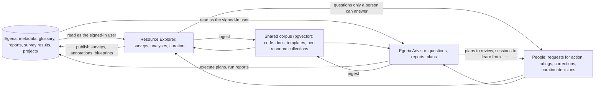
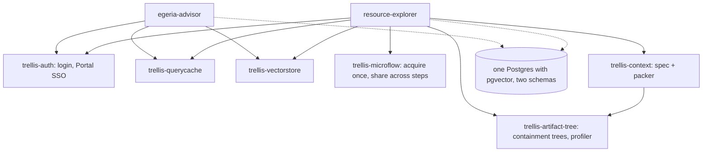
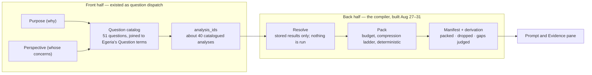
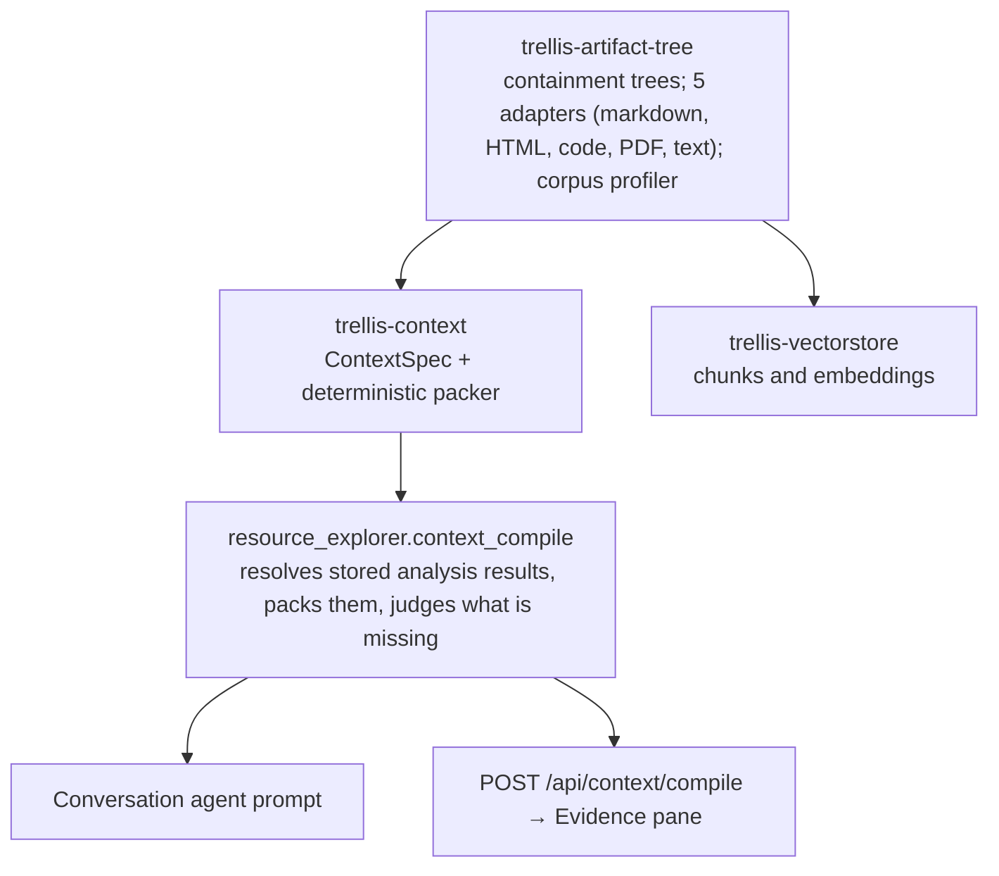
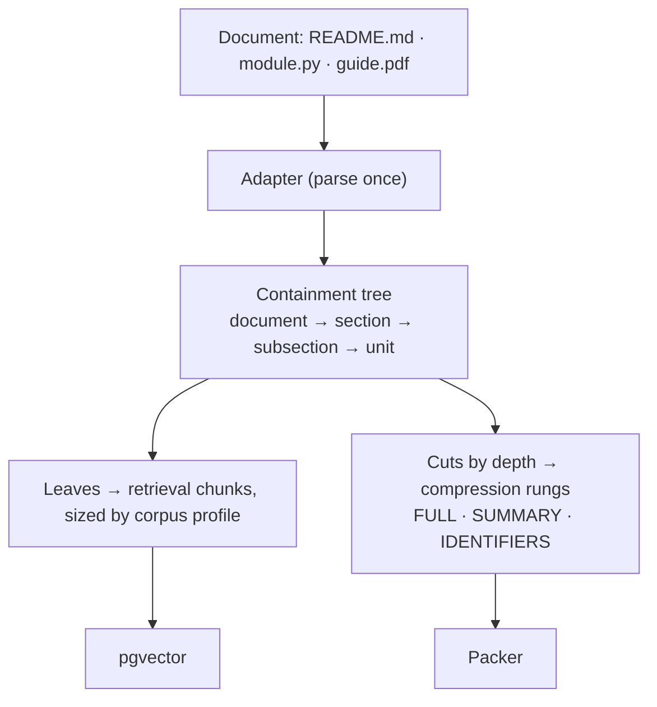
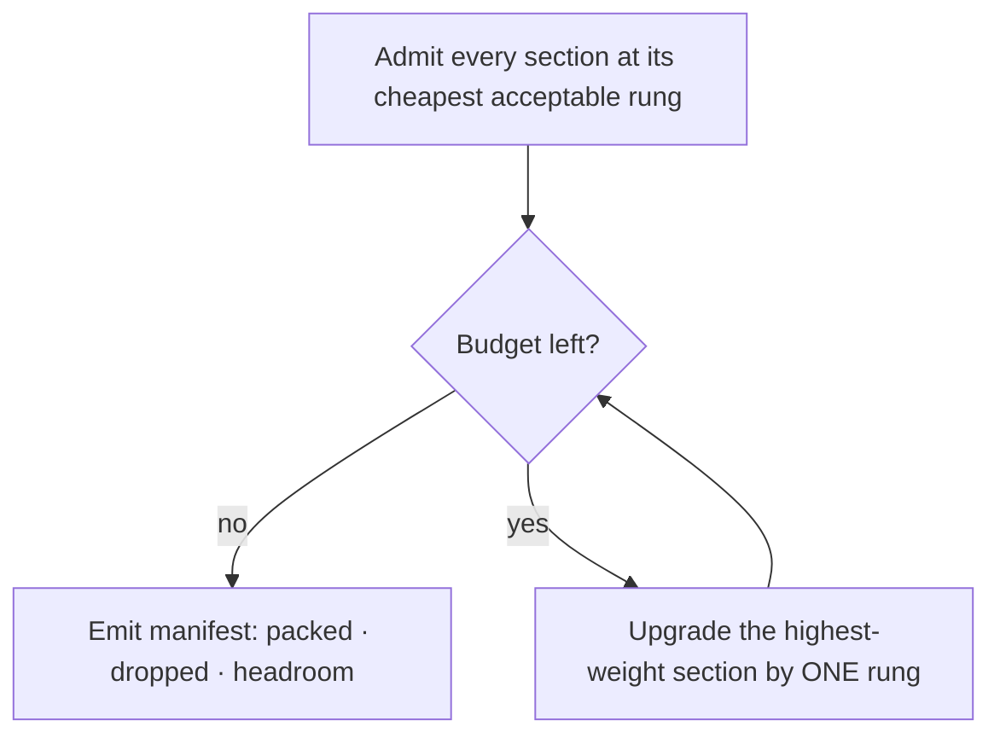
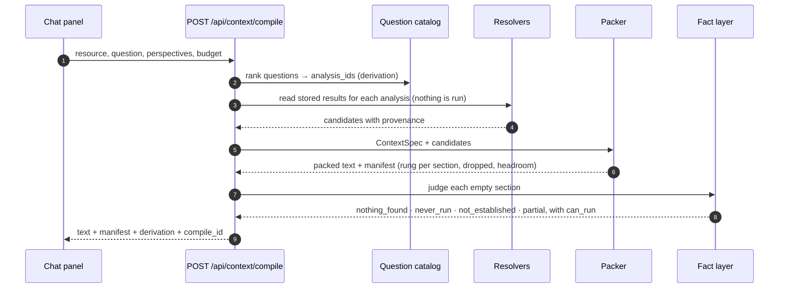
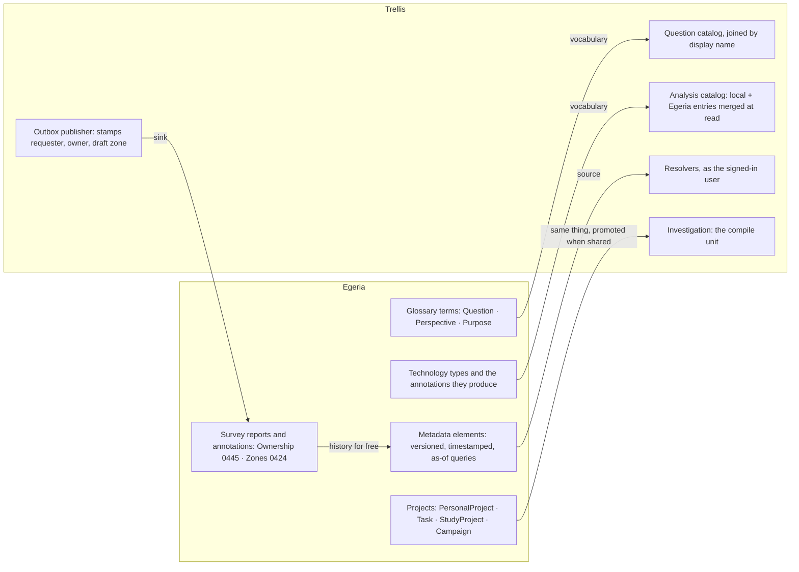
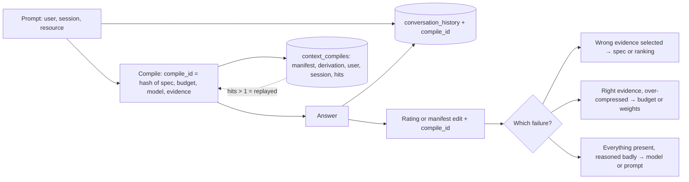

# Context intelligence in Trellis — a brief for a broader audience

*Presentation source, September 2026 (restructured 2026-09-08). Renders with Mermaid on GitHub and
in Obsidian; the slide version is the "Context Intelligence in Trellis" artifact and the matching
PowerPoint. Sources are named per section; every number is checkable against the repository, the
design documents, or the live database on 2026-09-08.*

---

## 1. What Egeria Advisor and Resource Explorer are for

Two applications, one catalog of record.

**Resource Explorer** discovers, surveys and catalogs information resources: Git repositories,
PostgreSQL databases and file systems. Every survey result that can be written to Egeria is
written there; local storage is a cache and a queue. Work is organised as a funnel of intents
(Scouting, Discovery, Assessment, Analysis, Enrichment, Understanding, Curate), about 40
catalogued analyses answer a curated catalog of 51 questions, and requests for action carry the
questions only a person can answer. It is for data engineers, stewards, DBAs, AI engineers and
security practitioners deciding whether to adopt, maintain or compare a resource.

**Egeria Advisor** is a conversational assistant for Egeria and pyegeria that runs entirely
locally: retrieval over nine collections of Egeria's own code, concepts, types, guides, notebooks
and Dr.Egeria templates, routed to specialist agents. It answers questions with runnable examples,
runs reports from Dr.Egeria report specs against a live Egeria, and produces literate governance
plans: describe a data-management task in plain language, get a reviewable and executable plan,
execute it, and keep the verified outcome. It is for developers, data engineers, data stewards and
governance officers.

Both apps sign users in with their Egeria identity, read Egeria as that user, and write back as
that user. Egeria is the vocabulary, the source, the sink and the clock for everything below.

## 2. How they evolved to use and produce context

### Egeria Advisor: from uniform chunks to context intelligence

| When | What changed |
|---|---|
| Jan–Feb 2026 | One collection, uniform 1000-character chunks, a 3B model. It worked, and it hallucinated. |
| Feb 2026 | Multiple collections with a router scoring domain-term overlap, intent keywords and priority. Routing accuracy about 60% on a 14-query suite. |
| Mar 2026 | Domain terms disambiguated, intent keywords and role-specific prompts: routing 100% on the same suite. Documentation hallucination measured at about 80% with uniform 512-token chunks; splitting docs into concepts, types and general with per-collection chunk size and thresholds brought it to about 27%. Python ingestion moved to AST boundaries. |
| Apr–May 2026 | Milvus to pgvector; Dr.Egeria MCP integration; a report pipeline with semantic search over report specs; a ninth collection of Dr.Egeria templates tuned differently from every other. |
| Jun 2026 | **Literate Governance with Context Intelligence.** Plans generated first and refined second; every session logged with user, perspective, intent overrides and correction events as the highest-value signal; 138 catalogued Dr.Egeria actions and a deterministic validator as the system's learned rules. |
| Jul 2026 | Report spec builder with a three-way parameter model and the question "is this parameter part of the spec's identity?", which later became the compiler's cache-key discipline. |

"Context intelligence" meant: retrieval parameters chosen per content type by measurement; the
user's role and purpose shaping what is retrieved and how it is phrased; every interaction captured
with enough context to learn from; rules that are inspectable and evolvable without touching the
model. About 92,400 indexed entities across nine collections and around 33,000 lines of Python by
July.

### Resource Explorer: from surveys to a question catalog

| When | What changed |
|---|---|
| Origin | Successor to Project Explorer: surveys organised by analysis and intent rather than by source, Egeria as the catalog of record from the start. |
| Aug 2026 | The survey model settles: microflows acquire a resource once and share it across steps; a survey definition runs its detailed surveys and an umbrella survey; results publish to Egeria as survey reports and annotations with the requester recorded. |
| Aug 14 | A curated question catalog, authored in a spreadsheet and generated into YAML, each question joined by name to an Egeria glossary term, carrying funnel stage, Perspectives, Purposes and how the tool can answer it today. |
| Aug 24 | Investigation, Purpose and Perspective measured against the real catalog: Purpose discriminates (0.22 overlap), Perspective does not (0.37, strictly nested). Purpose ranks; Perspective weights. |
| Aug 26 | A fact layer that separates measured, nothing found, never run, not established and partial. |
| Aug 30–31 | Context compilation wired into the chat: evidence packed from stored results, gaps judged, manifest shown in an Evidence pane. |

Context is consumed (stored analysis results, direct Egeria queries, a per-resource corpus, the
registry, what people add through requests for action) and produced (survey reports and
annotations owned by the publishing user and zoned as drafts until curated; findings and metrics;
architecture blueprints). The vocabulary is the expensive asset: 51 questions, about 40 analyses,
and their tagging. Data regenerates; tagging does not.

### Both apps sit inside the same loop

Context is not only what a model reads. What the apps write back, attributed and zoned, becomes
context for the next question. That loop is what makes provenance and attribution worth the trouble.

## 3. How we brought them together into Trellis

Both apps were imported into one `uv` workspace on 2026-08-06. The interesting work was the audit
before extracting anything: each module pair got one of three verdicts, near-identical (extract
as-is), diverged for a confirmed reason (extract with parameters, or port the more mature side),
or genuinely different problems (leave alone).

- Most apparent duplication was real divergence: two collection routers with the same class name
  solve different problems; windowed versus semantic chunking is a deliberate split.
- What did extract: a vector store, a query cache whose Advisor copy was documented as LRU and was
  actually FIFO, a shared login and Portal handoff, resource sharing, and later the tree and packer.
- The rules: a library has no CLI, no server, no Egeria client and no credentials; the arrows only
  point down; neither app is run as part of the other.

## 4. What we built before context compilation, and how it worked

**Resource Explorer** had a chat panel backed by retrieval, scoped to whichever resource was
selected and unaware of the Investigation, Purpose or Perspective chips beside it. A conversation
agent fetched its own evidence turn by turn with tools, falling back to older specialist agents
that handed the model raw tool output and an instruction not to speculate. Question dispatch
already existed for the checklist (Purpose and Perspective resolved to catalog questions and to
the analyses that answer them) but the chat never used it. A 57-line intent-to-content-type lookup
chose collections; a 21-line thumbs prompt collected feedback.

**Egeria Advisor** had a priority-tiered pattern classifier with an LLM fallback, routing to more
than ten specialist agents that each gathered their own context; a 400-line collection router
scoring explicit mentions, domain terms, intent keywords, policy boosts and feedback multipliers
over nine fixed collections; a 652-line feedback collector keyed on rating, category, perspective
and routing agent; and report specs with a draft, preview and save lifecycle and a clear rule for
which parameters change the data.

**What was good.** It answered real questions and shipped. Improvements were measured: routing
from about 60% to 100% on the Advisor's suite, documentation hallucination from about 80% to about
27%. The right instruments existed in pieces: a fact layer with honest states, a question catalog
joined to Egeria, a ranking engine, feedback dimensioned by perspective, a cache-key discipline,
perspective-aware prompting, session transcripts with corrections as signal.

**What was bad.** Absence looked like a fact: an analysis that never ran, one that ran and found
nothing, and one whose result could not be credited all reached the model as the same silence,
often filled by retrieved prose. No budget, so context grew until the window edge truncated it
silently. No provenance, so nothing could be cited or replayed. Assembly was duplicated per agent.
Feedback attached to the answer, not the context, so a poor rating could not say whether the
evidence or the model was at fault. And some chat tools still opened a SQLite file that had been
empty since the Postgres migration; the failure reached the model as an exception string to
narrate. 35 of the repository's first 559 commit messages name absence, silence, staleness or a
wrong zero: a true statement about the mechanism, read as a claim about the world.

## 5. How we added context compilation

The recognition was that Resource Explorer had already built the front half of a context compiler
and called it question dispatch:

The recommendation was never "adopt context compilers"; it was "finish the one already half-built,
using parts the Advisor had": its cache-key discipline, spec lifecycle and ranking engine.

Sequenced to protect the vocabulary and measured at every step:

| Phase | What | Why in this order |
|---|---|---|
| 0 | Emit the derivation trace; a standing coverage report; the nesting invariant as a test | Instruments first; no compiler yet |
| 1 | Declared availability (inline or queued) on the analysis catalog | A compile must never trigger a survey; the derived version was reversed the day a counterexample appeared |
| 2 | The containment tree, five adapters, a profiler | The only item with a clock: re-ingestion cost grows with the corpus |
| 3 | Spec and deterministic packer, wired into the chat and an Evidence pane | The first point at which the compiler affects a user |
| now | Content-addressed compile ids, persisted compiles, turns and feedback linked | The dataset for the first quality experiment, built before the experiment |
| later | The Advisor adopts Investigation as its compile unit and the shared packages | Gated on where the Investigation table lives and who writes it |

Three rules held: nothing curated is invalidated; everything is additive and off by default; stop
investing in agent-side assembly. Five design claims were falsified by running rather than reading:

| Claim | What the run showed |
|---|---|
| Chunk size derives from unit size | 340 / 164 / 356 against 768 / 1,024 / 1,536: wrong magnitude and order |
| Chunk size derives from document size | fits documentation; on code the p75 "document" is a 32k-token module |
| Seven analyses were gaps | the resolver read one table; the analyses stored through their own readers and held data |
| Those analyses "have NOT run" | two of three run cleanly and emit annotations explaining the empty result |
| Availability can be derived from run time | `architecture_recovery` computes in 5.9 s but acquires for 14–30 s; it became a declared field |

## 6. How it works now

### Architecture

| Package | Non-test code (lines) | Tests |
|---|---:|---:|
| trellis-artifact-tree | 1,659 | 99 |
| trellis-context | 548 | 24 |
| RE bridge (`context_compile.py`) | 500 | 53 |

### Ingestion: one parse, two consumers

Chunk size is a tuned parameter; rung boundaries are containment; one parse serves both. The tree
is the format-independence boundary and absence of an adapter degrades, never blocks. Provenance
keeps `fetched_at` and `source_timestamp` separate. Live: 16,001 artifacts, 277,886 nodes,
509,989 rungs.

### The packer: ordinary code, and that is the design

| Guarantee | Meaning |
|---|---|
| Determinism | same spec + same inputs → byte-identical output |
| Monotonicity | more budget never removes content |
| Symmetry | grouped sections pack at equal budget and the same rung |
| Hard ceiling | the budget is never exceeded; it fails rather than truncating |

Breadth before fidelity: weight governs upgrade priority, not share, because proportional
allocation was not monotone. `mode: rank | gate` and `floor` are typed fields because both had
failed silently as conventions.

### A compile, end to end

### Kinds and sources of context

| Kind | Where it comes from | How it enters a compile | Fixed or moving? |
|---|---|---|---|
| **Stored analysis results** | about 40 catalogued analyses, RE's own surveyors plus Egeria-native surveys merged at read time | findings table or each analysis's own reader; three rungs derived for free; answers 22 of 51 questions | materialised; refreshed by the scheduler, never run inside a compile |
| **Direct Egeria queries** | metadata elements, ownership, zones, survey reports, technology types, as the signed-in user | resolvers; 11 questions | live, and as-of-able |
| **Retrieved corpus** | RE: 8 collection types per resource; EA: 9 collections over Egeria's code and docs | pgvector similarity via each app's router; the agent's fallback | re-embedded on refresh; drift reported, never auto-enabled |
| **Registry and activity** | investigations, membership, schedules, activity, requests for action | registry reads; scopes the compile unit | moving with use |
| **Human-provided** | enrichment context, RFA decisions, ratings, manifest edits | 7 questions need a person; feedback tunes weights later | whenever people act |
| **Cross-app** | EA reads RE's code-symbol tables directly | same shape as EA's own store | as fresh as RE's last ingest |
| **Report specs and governance docs** | Dr.Egeria report specs and plan documents | EA's report pipeline runs the spec against live Egeria | specs static; results live |

The catalog records how each of its 51 questions is answerable today: 22 by analysis, 11 directly,
7 by a person, 6 mixed, 1 by chart, 1 partially, 3 known gaps.

### Relationship to Egeria: vocabulary, source, sink and clock

### Static or dynamic?

A compile reads materialised state and nothing else; that is what makes it deterministic,
sub-second, and safe on every chat turn. Between compiles the state moves: the scheduler re-runs
analyses, bootstrap check-and-heal runs about every ten minutes, refresh re-ingests, queued gaps
enqueue work, the outbox publishes with retry, and people act. Three grains of recompile: re-pack
(milliseconds), re-resolve (moderate), re-gather (asynchronous). Time is explicit: `as_of` is
identity-bearing; `fetched_at` and `source_timestamp` are separate; a resolver reading a live source
must be declared `current_only`, and the registry that would carry that tag is not built yet.

## 7. Advantages and disadvantages

**Advantages.** Gaps become answers. Provenance is a citation contract. Determinism, monotonicity,
symmetry and a hard ceiling are all testable because the packer is ordinary code. Explanations are
replayable once as-of is pinned. Small models get a fair budget. Users get control with a return
path through the manifest. Assembly lives in one place, so an improvement lands once.

**Disadvantages and open costs.** Machinery for a possibly low-traffic surface. Only Resource
Explorer is wired; the Advisor's agents still assemble their own context. The compression ladder
is free but shallow: rungs are derived from findings, and precomputed summaries at ingest are not
built. Determinism holds only over materialised inputs. It depends on curated tagging, and one
Perspective reaches nothing. Budgets are in characters. And answer quality is unmeasured.

## 8. How we are testing and improving

| Measure | Value | Where from |
|---|---|---|
| Compile latency, identical live calls, 4,000-char budget | 0.35–0.44 s | live API, 2026-09-05 |
| Byte-identical responses across those calls; one persisted row with `hits = 2` | 3 of 3; yes | live API, 2026-09-05 and 2026-09-08 |
| Tests over tree, packer and bridge | 176 | repository |
| Artifacts with trees; nodes; rungs | 16,001; 277,886; 509,989 | `artifact_tree` schema |
| Profiler versus hand-tuned chunking on egeria-docs | document p75 within ~20% (931 / 844 / 1,742 vs 768 / 1,024 / 1,536) | corpus-profiler-design.md §7 |
| Questions; perspectives; analyses inline / queued | 51; 12; 20 / 9 | catalogs |

None of these says the answers got better. Six experiments would settle that:

| Question | Experiment | Metric | Instrument |
|---|---|---|---|
| Do compiled-evidence answers beat RAG-only answers? *(unmeasured)* | the 51 catalog questions × a handful of surveyed repos, same model, with and without packed evidence | citation rate, correct gap acknowledgement, unsupported-claim count; RAGAS faithfulness | judge model plus a human sample; MLflow |
| Does Perspective weighting help? *(unmeasured)* | uniform versus perspective weights, per perspective | rating by perspective; rung distribution | perspective-dimensioned feedback |
| Are profiler-derived chunk sizes better? *(unmeasured)* | re-embed egeria-docs at derived sizes; run the Advisor's question set against both | retrieval hit rate at k, answer rating | trellis-vectorstore, MLflow |
| Where is the budget knee? | same questions at 2k / 4k / 8k / 16k characters | quality versus budget; time to first token per tier | manifest headroom |
| Is replayability real per resolver? | recompile at a pinned as-of; diff manifests | diff count by resolver; `hits` on persisted compiles | context_compiles table |
| Which failure was it? | **built 2026-09-08:** compile ids on turns and feedback | wrong evidence / over-compressed / model reasoned badly | context_compiles + feedback |

### Closing the loop, built 2026-09-08

Every compile gets a content-addressed id and is persisted with its manifest and derivation; a
repeat increments a hit counter. Chat turns, the CLI, resource feedback and the metrics store carry
the id. Verified live: two identical compiles produced one row with two hits; a chat turn linked
both turns to the compile and to the signed-in user. Found on the way: the streaming route ran in
a thread that dropped the caller, so chat turns were attributed to nobody; the same missing context
in the queued survey path would have published private surveys publicly, and is now pinned by a
test.

## 9. Summary and next steps

**Summary.** The compiler is built, tested for its structural guarantees, wired into one real
surface, fast enough to be invisible, and, as of this week, instrumented so that every prompt, its
exact context and its rating share one key. What it does to answer quality is unmeasured, and the
first experiment can run now.

```mermaid
flowchart LR
  subgraph DONE["Shipped"]
    direction TB
    d1["Derivation trace"]
    d2["Coverage report + nesting test"]
    d3["Containment tree, 5 adapters"]
    d4["Spec + deterministic packer"]
    d5["RE chat + Evidence pane"]
    d6["availability: inline | queued"]
    d7["Pointers for oversized findings"]
    d8["Compile ids, persisted compiles, turns and feedback linked"]
  end
  subgraph NEXT["Next"]
    direction TB
    n1["Experiment 1: compiled evidence versus RAG-only"]
    n2["Envelope fields at ingest (source guid, version, as_of)"]
    n3["as_of as a spec parameter (replayable compiles)"]
    n4["Profiler boundary discovery (propose slices, never enable)"]
  end
  subgraph LATER["Later"]
    direction TB
    l1["Advisor adopts Investigation as its compile unit"]
    l2["Report narration from the spec's own evidence"]
    l3["Ladder rungs precomputed at ingest by a larger model"]
    l4["AI-ready data product = ships a compilable spec"]
  end
  DONE --> NEXT --> LATER
```

**Decisions to make first:** which experiment runs first (compiled-versus-RAG); where the
Investigation table lives and who writes it; whether the demo boxes collect feedback by default;
which surface the compiler serves next.

### References and inspirations

1. Lewis et al., *Retrieval-Augmented Generation for Knowledge-Intensive NLP Tasks*, NeurIPS 2020.
2. Liu et al., *Lost in the Middle: How Language Models Use Long Contexts*, TACL 2024 (arXiv 2307.03172).
3. Sarthi et al., *RAPTOR: Recursive Abstractive Processing for Tree-Organized Retrieval*, ICLR 2024 (arXiv 2401.18059).
4. Jiang et al., *LLMLingua* (EMNLP 2023) and *LongLLMLingua* (ACL 2024).
5. Packer et al., *MemGPT: Towards LLMs as Operating Systems*, 2023 (arXiv 2310.08560).
6. Chroma Research, *Evaluating Chunking Strategies for Retrieval*, July 2024.
7. Anthropic, *Introducing Contextual Retrieval* (2024) and *Effective context engineering for AI agents* (2025).
8. Manus, *Context Engineering for AI Agents: Lessons from Building Manus*, 2025.
9. Es et al., *RAGAS: Automated Evaluation of Retrieval Augmented Generation*, 2023 (arXiv 2309.15217).
10. *On the Reproducibility Limitations of RAG Systems*, arXiv 2509.18869 (2025), and *RAGdeterm* (ScienceDirect, 2026), as recorded in `context-compilation-design.md` §9.
11. Gao et al., *Retrieval-Augmented Generation for Large Language Models: A Survey*, 2023 (arXiv 2312.10997).
12. W3C, *PROV-DM: The PROV Data Model*, 2013.
13. ODPi Egeria, *Open Metadata Types*: 0424 Governance Zones, 0445 Governance Roles and Ownership, and the Question / Perspective glossary classifications.

Not found in the literature: the replayability contract stated as *same spec + same as-of + same
materialised state → same context*. If it exists in print it is worth citing; if not, worth writing up.
