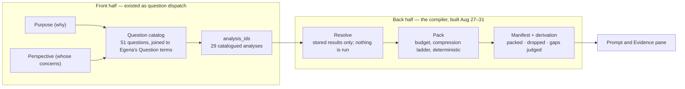
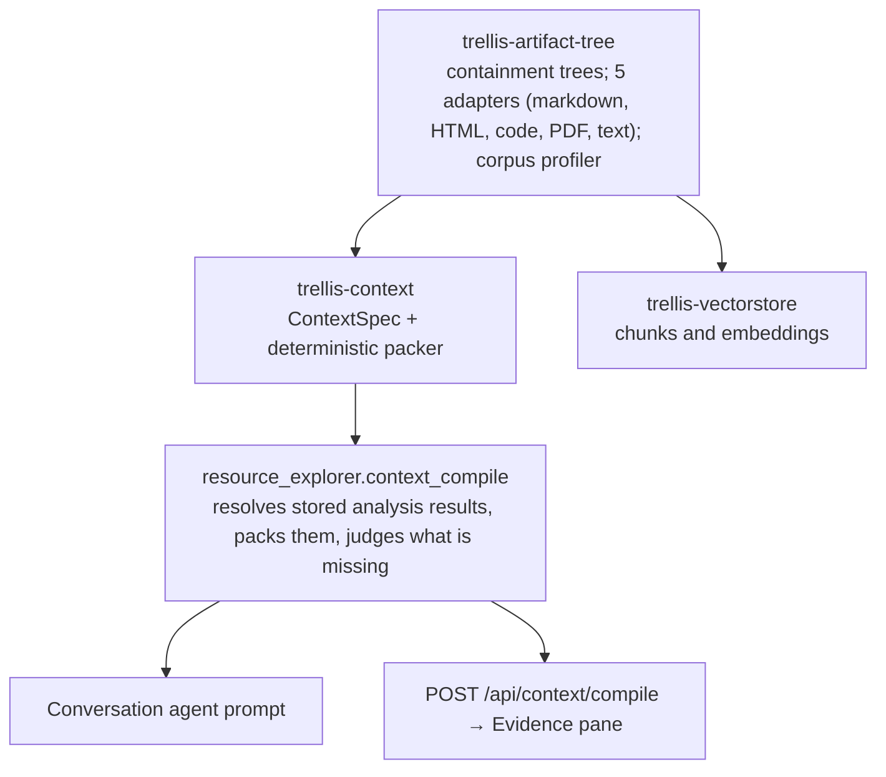
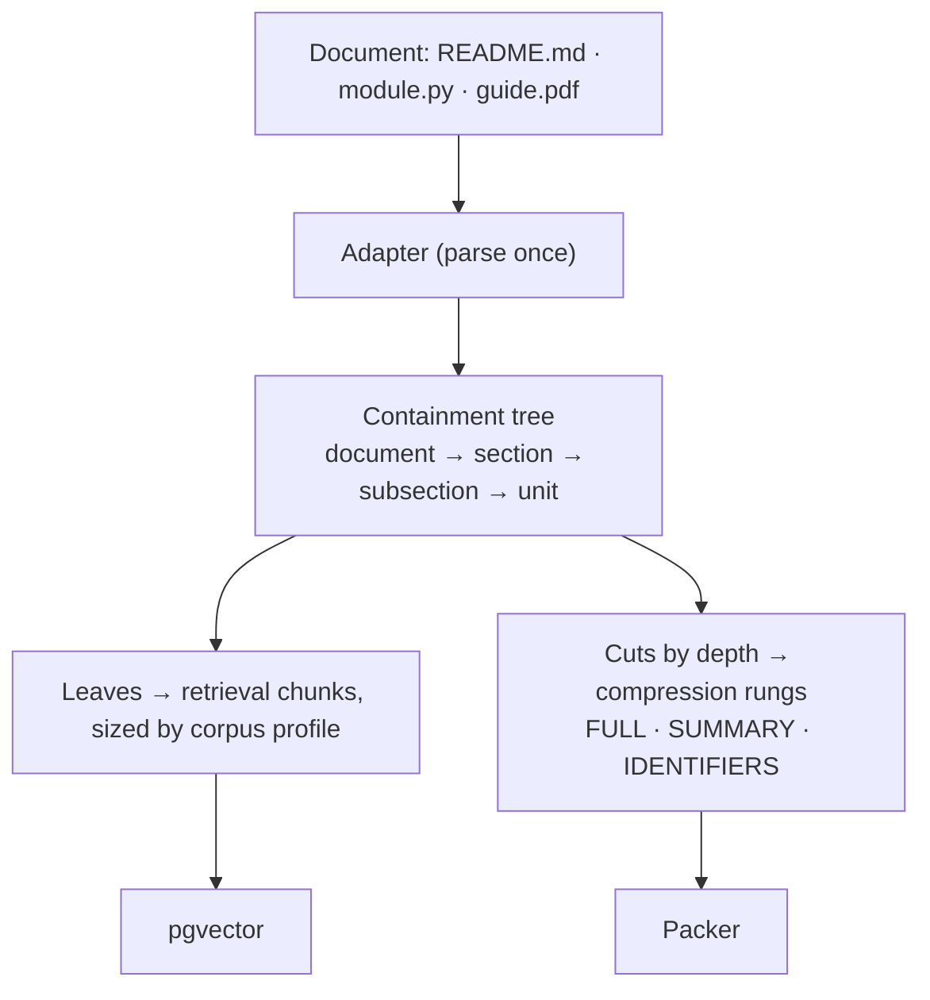
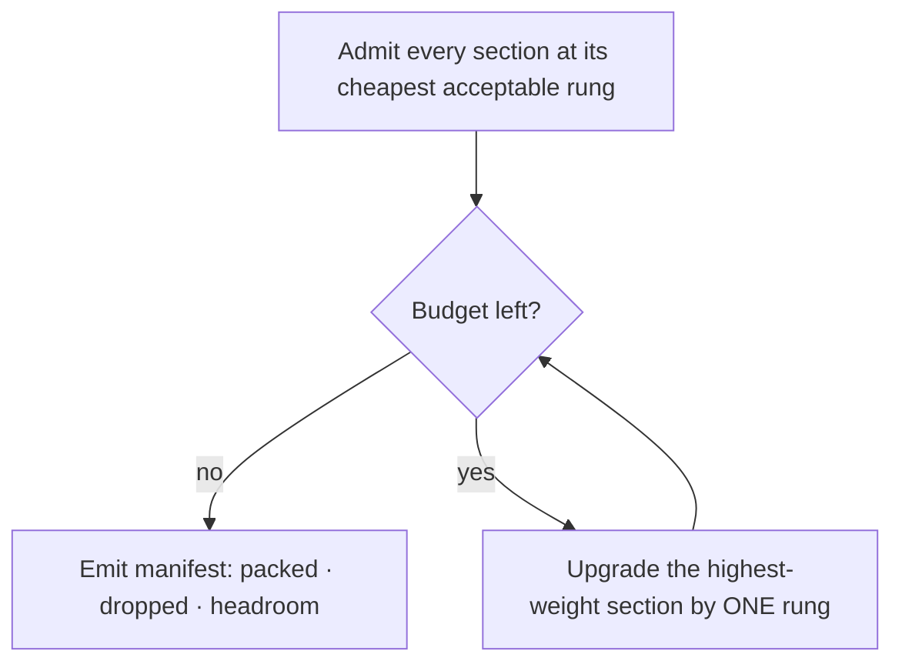
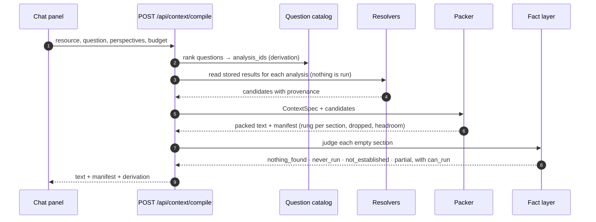
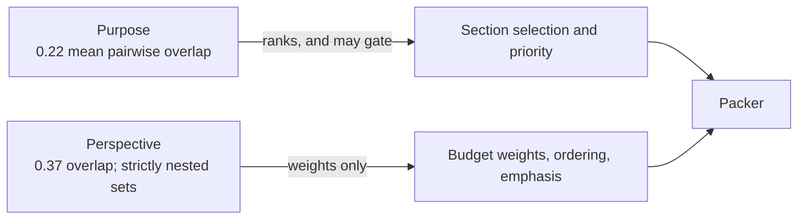

# Context compilation in Trellis — a short brief

*Presentation source, September 2026. Renders with Mermaid on GitHub and in Obsidian; the slide
version is the "Context Compilation in Trellis" artifact. Sources: `context-compilation-design.md`,
`context-compilation-architecture.md`, `corpus-profiler-design.md`,
`packages/resource-explorer/docs/investigation-framing-design.md`, and the live database on
2026-09-05. Every number is checkable against those.*

---

## 1. The problem: absence that looks like a fact

Both apps answer questions from gathered evidence: surveys, code analyses, Egeria queries, retrieved
documentation. Before the compiler, each specialist agent assembled its own context by hand, and the
model could not tell these apart:

| What happened | What the model saw |
|---|---|
| An analysis ran and genuinely found nothing | an empty section, or RAG prose that quietly filled the hole |
| An analysis has never run for this resource | the same |
| An analysis ran but its result cannot be credited here | the same |
| A section was cut for budget | nothing; silent truncation at the window edge |
| Where a span came from and how old it is | nothing; no provenance travelled with the text |

These are the same number and opposite answers. 35 of the repository's first 559 commit messages
name absence, silence, staleness or a wrong zero; it is the dominant bug class, and it always has the
same shape: a true statement about the mechanism, read as a claim about the world.

## 2. The idea: finish the compiler Resource Explorer already had

"Context compiler" is a fashionable label for spec → resolvers → budget-aware packing → provenance.
It applies here for a non-generic reason: the spec language, the intermediate representation and the
resolver registry already existed. The recommendation was never "adopt context compilers"; it was
"finish the one already half-built, using parts the Advisor had" (its cache-key discipline, spec
lifecycle and ranking engine).

## 3. Architecture

| Package | Non-test code (lines) | Tests |
|---|---:|---:|
| trellis-artifact-tree | 1,659 | 99 |
| trellis-context | 548 | 24 |
| RE bridge (`context_compile.py`) | 500 | 41 |

The tree and context packages are pure over their inputs: no LLM client, no store, no credentials.
Only the bridge touches a database. Both shared packages were written to be adopted by the Advisor
unchanged.

## 4. Ingestion: one parse, two consumers

- Chunk size is a tuned parameter driven by content profile; rung boundaries are a containment
  question. Neither derives from the other, so one parse emits a tree that serves both.
- The tree is the format-independence boundary: a new format costs an adapter, not a pipeline change.
  Absence of an adapter degrades (flat ingest) and never blocks.
- Provenance per artifact keeps `fetched_at` and `source_timestamp` separate: when the fact was true
  versus when we read it. `extraction_fidelity` is `structural` or `inferred` (PDF layout).
- Live on 2026-09-05: 16,001 artifacts with trees, 277,886 nodes, 509,989 rungs; 15,975 structural,
  26 inferred; 20% near-empty, almost all short markdown stubs.

## 5. The packer: ordinary code, and that is the design

| Guarantee | Meaning |
|---|---|
| Determinism | same spec + same inputs → byte-identical output |
| Monotonicity | more budget never removes content |
| Symmetry | grouped sections (a comparison) pack at equal budget and the same rung |
| Hard ceiling | the budget is never exceeded; it fails rather than truncating |

Breadth before fidelity. A proportional per-section allocation was tried first and is not monotone:
a heavy section upgrading to FULL could evict a lighter one. So weight governs upgrade priority, not
share, and one rung per round means a low-weight section can overtake a high-weight one mid-climb,
which is the right default while Perspective weighting is unmeasured. Two distinctions are typed
fields because both had failed silently as conventions: `mode: rank | gate` and `floor`.

## 6. A compile, end to end

Three artifacts come back together: the **derivation** (why these sections exist), the **manifest**
(what survived the budget, at which rung; and the honest negative answer "ranked below the budget line
at rung N"), and **gaps, judged** with the vocabulary the fact layer already had.

## 7. Kinds and sources of context

Retrieval is one source among several. The compiler is indifferent to resolver kind; all it needs
is the cost tier and whether the resolver may run inline.

| Kind | Where it comes from | How it enters a compile | Fixed or moving? |
|---|---|---|---|
| **Stored analysis results** | about 40 catalogued analyses: RE's own surveyors (health, dependencies, security and CVE scans, licences, CHAOSS metrics, architecture recovery, API surface…) plus Egeria-native surveys, merged into one menu at read time | findings table or each analysis's own reader; three rungs derived for free (findings, one line per check, check names). Answers 22 of the 51 catalog questions | materialised; refreshed by the scheduler, never run inside a compile |
| **Direct Egeria queries** | metadata elements, ownership, zones, survey reports, technology types, via pyegeria as the signed-in user | resolvers; 11 questions are answered this way | live, and as-of-able: Egeria versions and timestamps every element |
| **Retrieved corpus** | RE: 8 collection types per resource (markdown, Python, Java, JavaScript, Go, SQL, PDFs, web docs). EA: 9 collections over Egeria's code, concepts, types, guides, notebooks and Dr.Egeria templates | pgvector similarity, routed by each app's collection router; the conversation agent's fallback when no analysis answers | re-embedded on refresh; collection drift reported, never auto-enabled |
| **Registry and activity** | investigations and membership, schedules, activity log, requests-for-action | registry reads; scopes the compile unit and the frontier | moving with use |
| **Human-provided** | enrichment context, RFA decisions, ratings and manifest edits | 7 questions can only be answered by a person; feedback tunes weights later | arrives whenever people act |
| **Cross-app** | EA reads RE's code-symbol and relationship tables directly (cross-schema read) | same shape as EA's own symbol store, so its analytics do not change | as fresh as RE's last ingest |
| **Report specs and governance docs** | Dr.Egeria report specs (semantic search over question specs, then Egeria's own spec finder) and plan documents with inbox / outbox / trash | EA's report pipeline runs the spec against live Egeria and can narrate from its own rows | specs static; results live |

The question catalog records how each of its 51 questions can be answered today: 22 by analysis,
11 directly from Egeria, 7 by a person, 6 mixed, 1 by chart, 1 partially, and 3 known gaps.

## 8. Relationship to Egeria: vocabulary, source, sink and clock

- **Vocabulary.** Questions, Perspectives and Purposes are Egeria glossary terms; the catalog joins
  on the display name, which keeps the question corpus Egeria-native and queryable. The analysis
  menu merges Egeria's technology types at read time, fail-soft.
- **Source.** Direct resolvers query Egeria as the user who asked, so what they can see is what the
  compile contains.
- **Sink.** Published surveys carry the requester, an Ownership classification and the draft zone, so
  evidence Trellis produced is attributable and governable like any other metadata.
- **Clock.** Egeria versions and timestamps elements and answers as-of queries with no history
  limit. Publishing analysis results buys unlimited history without a second archive, and pinning
  as-of is what makes a compile replayable.

## 9. Static or dynamic?

A compile reads materialised state and nothing else. That is what makes it deterministic,
sub-second, and safe to call on every chat turn. Everything that moves the state happens around the
compile, not inside it:

| What moves the state | Cadence |
|---|---|
| Scheduler re-runs analyses on a per-resource schedule | as configured; every run logged |
| Bootstrap check-and-heal re-runs missing catalog batches | about every 10 minutes while the web role is up |
| Refresh re-ingests a resource; collection drift is reported, not applied | on demand or scheduled |
| Queued gaps enqueue the analysis that would change the answer | the worker picks it up; the compile did not wait |
| Outbox publishes results to Egeria with retry | continuous |
| People: enrichment, RFA decisions, ratings, manifest edits | whenever they act |

Three grains of recompile with very different costs: **re-pack** (weights, rungs, a section on or
off; milliseconds, nothing re-fetched), **re-resolve** (as-of, filters, membership; moderate,
resolvers re-read stored state), **re-gather** (an analysis that has not run; asynchronous, queued,
not awaited).

Time is explicit, not assumed. `as_of` is a spec parameter and identity-bearing. `fetched_at` and
`source_timestamp` travel separately, so an old fact and a stale read are distinguishable. A resolver
that reads a live source at compile time must be declared `current_only`, and a past-as-of compile
containing one is labelled mixed rather than quietly packed; the resolver-kind registry that would
carry that tag is not built yet.

## 10. Why it is worth having

- **Gaps become answers.** The prompt names which analyses have not run and which found nothing.
- **Provenance is a citation contract.** Every span carries where it came from and as of when; an
  uncited claim is a detectable defect.
- **Replayable explanations.** With Egeria's as-of time queries, the same spec at the same time
  recompiles identically. An explanation you can re-run is an audit, not an assertion.
- **Small models get a fair budget.** Demo tiers cap context at 8k tokens and retrieval at 2k;
  degrading down a ladder beats truncating at the window edge.
- **User control with a return path.** Purpose and Perspective chips already existed as UI state; the
  manifest shows what they did, and an edited manifest is a spec override.
- **Never blocks on a survey.** Resolvers are declared `inline` or `queued`; a compile reports a
  queued gap and proceeds.

Measured against the real catalog: no Perspective reaches an analysis another does not, so Perspective
varies the size of a result and never its content. Disqualifying for a filter, close to ideal for a
budget allocator, and a safety property: running out of budget can never drop the one section a
perspective alone needed.

## 11. Numbers we have

| Measure | Value | Where from |
|---|---|---|
| Compile latency, three identical live calls, 4,000-char budget, egeria-python | 0.35–0.44 s | `POST /api/context/compile`, 2026-09-05 |
| Byte-identical responses across those calls | 3 of 3 | same |
| Sections packed / budget used / dropped / gaps judged | 16 / 3,981 of 4,000 / 0 / 2 | same |
| Tests over tree, packer and bridge | 164 | repository |
| Artifacts with trees; nodes; rungs | 16,001; 277,886; 509,989 | `artifact_tree` schema |
| Questions in the RE catalog today | 51 | question_catalog.yaml |
| … at the time of the Egeria join check, all 41 then present were among Egeria's 84 Question terms | 41 / 84 | catalog coverage script |
| Perspectives; questions carrying four or more | 12; 17 of 41 | investigation-framing measurement |
| Analyses declared inline / queued | 20 / 9 | analysis catalog |
| Perspectives reaching zero analyses | 1 (Privacy) | coverage script |

Corpus profiler versus hand-tuned chunking on egeria-docs (tokens):

| Slice | Docs | p75 section | p75 document | Hand-picked |
|---|---:|---:|---:|---:|
| concepts | 179 | 340 | 931 | 768 |
| types | 168 | 164 | 844 | 1,024 |
| general | 562 | 356 | 1,742 | 1,536 |

Section size fails on magnitude and ordering; document size lands within about 20% of what a careful
reader chose by hand. On code the document rule fails in turn (pyegeria's p75 module is 32,467 tokens),
which produced the current rule: units-per-document decides which unit is coherent, then size to it.

**None of these numbers says the answers got better.** They are properties of the catalog, the corpus
and the packer.

## 12. The measurement habit: five claims falsified by running

| Claim | What the run showed |
|---|---|
| Chunk size derives from unit size | 340 / 164 / 356 against 768 / 1,024 / 1,536: wrong magnitude and order |
| Chunk size derives from document size | fits documentation; on code the p75 "document" is a 32k-token module |
| Seven analyses were gaps | the resolver read one table; the analyses stored through their own readers and held data |
| Those analyses "have NOT run" | two of three run cleanly and emit annotations explaining the empty result |
| Availability can be derived from run time | `architecture_recovery` computes in 5.9 s but acquires for 14–30 s; it became a declared field |

The pattern behind all five is the one in §1. The response was not more care; it was borrowing a
vocabulary that already separated *ran and found nothing* from *never ran*. Status notes are dated,
and falsified ones are struck through rather than deleted, because the reasoning is the useful part.

## 13. What is not measured, and the experiments that would settle it

| Question | Experiment | Metric | Instrument |
|---|---|---|---|
| Do compiled-evidence answers beat RAG-only answers? *(unmeasured)* | the 51 catalog questions × a handful of surveyed repos; same model, prompt with and without packed evidence | citation rate, correct gap acknowledgement, unsupported-claim count; RAGAS faithfulness as a second opinion | judge model plus a human sample; MLflow |
| Does Perspective weighting help? *(unmeasured)* | ablation: uniform versus perspective weights, per perspective | rating by perspective; rung distribution per section | perspective-dimensioned feedback (the Advisor already collects it) |
| Are profiler-derived chunk sizes better than hand-picked? *(unmeasured)* | re-embed egeria-docs at derived sizes; run the Advisor's question set against both | retrieval hit rate at k, answer rating | trellis-vectorstore, MLflow |
| Where is the budget knee? | same questions at 2k / 4k / 8k / 16k characters | quality versus budget; time to first token per tier | manifest headroom, model tiers |
| Is replayability real per resolver? | recompile N times at a pinned as-of; diff manifests | diff count by resolver; a `deterministic` tag in the registry | packer determinism test, extended |
| Which failure was it? | add `manifest_id` to feedback records first, then classify poor answers | wrong evidence / over-compressed / model reasoned badly | one column; cheap now, expensive later |

Feedback volume today: 10 Resource Explorer ratings and no chunk-level feedback, so the second and
sixth rows need a collection period. The first and third can run now against materialised state.

## 14. Continuing the work

```mermaid
flowchart LR
  subgraph DONE["Shipped"]
    direction TB
    d1["Derivation trace"]
    d2["Coverage report + nesting test"]
    d3["Containment tree, 5 adapters"]
    d4["Spec + deterministic packer"]
    d5["RE chat + Evidence pane"]
    d6["availability: inline | queued"]
    d7["Pointers for oversized findings"]
  end
  subgraph NEXT["Next"]
    direction TB
    n1["Envelope fields at ingest (source guid, version, as_of)"]
    n2["manifest_id on feedback"]
    n3["as_of as a spec parameter (replayable compiles)"]
    n4["Profiler boundary discovery (propose slices, never enable)"]
  end
  subgraph LATER["Later"]
    direction TB
    l1["Advisor adopts Investigation as its compile unit"]
    l2["Report narration from the spec's own evidence"]
    l3["Ladder rungs precomputed at ingest by a larger model"]
    l4["AI-ready data product = ships a compilable spec"]
  end
  DONE --> NEXT --> LATER
```

Three sequencing rules: protect the curated vocabulary (51 questions, about 40 analyses, their tagging), not
the schema; instruments before features; stop investing in agent-side context assembly and convert
one specialist agent to a resolver at a time, measuring each.

## 15. References and inspirations

1. Lewis et al., *Retrieval-Augmented Generation for Knowledge-Intensive NLP Tasks*, NeurIPS 2020.
   The baseline both apps started from.
2. Liu et al., *Lost in the Middle: How Language Models Use Long Contexts*, TACL 2024
   (arXiv 2307.03172). Position and volume matter; a budget and an ordering policy are not optional.
3. Sarthi et al., *RAPTOR: Recursive Abstractive Processing for Tree-Organized Retrieval*, ICLR 2024
   (arXiv 2401.18059). Multi-resolution summaries over a tree; the closest published relative of the
   containment tree and its rungs.
4. Jiang et al., *LLMLingua* (EMNLP 2023) and *LongLLMLingua* (ACL 2024). Prompt compression as a
   first-class step; the ladder does it structurally rather than token by token.
5. Packer et al., *MemGPT: Towards LLMs as Operating Systems*, 2023 (arXiv 2310.08560). Tiered
   context with explicit paging.
6. Chroma Research, *Evaluating Chunking Strategies for Retrieval*, technical report, July 2024.
   Chunk size measurably changes retrieval quality; the motivation for a profiler over constants.
7. Anthropic, *Introducing Contextual Retrieval* (2024) and *Effective context engineering for AI
   agents* (2025). Provenance prepended to chunks; "the smallest set of high-signal tokens".
8. Manus, *Context Engineering for AI Agents: Lessons from Building Manus*, 2025. The practitioner
   framing of context as a compiled artifact with a cache key.
9. Es et al., *RAGAS: Automated Evaluation of Retrieval Augmented Generation*, 2023
   (arXiv 2309.15217). Faithfulness and context-precision metrics for the experiments above.
10. *On the Reproducibility Limitations of RAG Systems*, arXiv 2509.18869 (2025), and *RAGdeterm*
    (ScienceDirect, 2026), as recorded in `context-compilation-design.md` §9. Retrieval-side
    nondeterminism is a distinct problem; structured retrieval helps but does not guarantee replay.
11. Gao et al., *Retrieval-Augmented Generation for Large Language Models: A Survey*, 2023
    (arXiv 2312.10997). The taxonomy the design uses to place itself.
12. W3C, *PROV-DM: The PROV Data Model*, 2013. The provenance envelope's fields are a small subset.
13. ODPi Egeria, *Open Metadata Types*: 0424 Governance Zones, 0445 Governance Roles and Ownership,
    and the Question / Perspective glossary classifications the catalog joins to.

Not found in the literature: the replayability contract stated as *same spec + same as-of + same
materialised state → same context*. If it exists in print it is worth citing; if not, worth writing up.

## 16. For discussion

- Is the Chat panel the right first surface? The payoff scales with how much it is used; report
  narration in the Advisor may be the higher-traffic path.
- Where does the Investigation table live, and who writes it? The Advisor cannot adopt the compile
  unit until this is decided.
- How much feedback is enough, and should the demo boxes collect it by default?
- Which experiment first? Compiled-versus-RAG justifies the whole line of work and can run today.
- Is "AI-ready data product = ships a compilable spec" a definition we would defend?

**What we would say today, honestly:** the compiler is built, tested for its structural guarantees,
wired into one real surface, and fast enough to be invisible. What it does to answer quality is
unmeasured. The instruments that would measure it are cheap, additive, and next in line.
