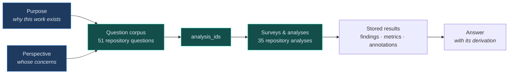
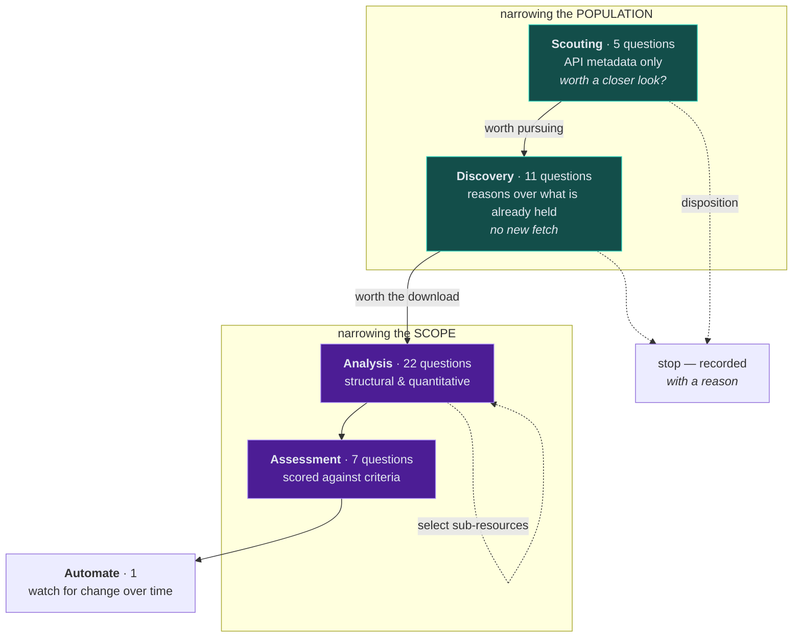
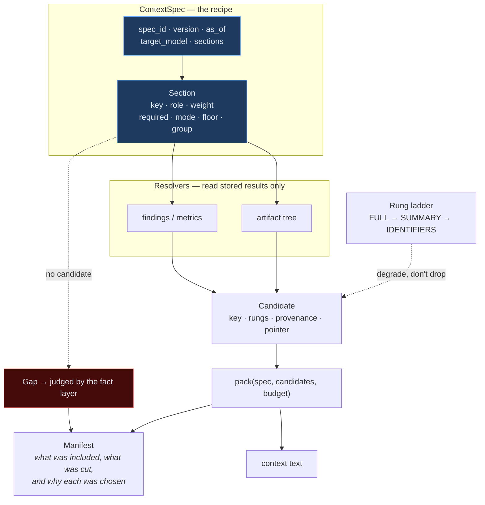
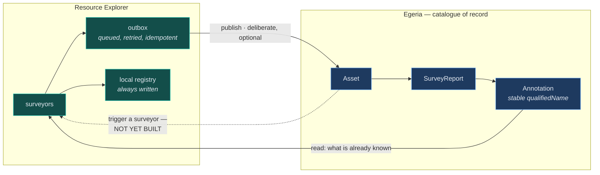

# Architecture Recovery in Practice — from a question someone actually has to an answer they can act on

**Status:** reference, current as of 2026-09-02.
**Audience:** written to stand alone. It assumes no knowledge of Resource Explorer,
Egeria, or the rest of Trellis.

**Contributed to the LF AI & Data Context Intelligence Workgroup.**
**Contact:** Dan Wolfson — dan.wolfson@pdr-associates.com

---

## 1. The situation

An engineering group is considering a large open-source repository. Nobody in the
room has read it. The decision in front of them is not "is this good code" — it is
one of several quite different decisions that happen to look alike from a distance:

- **Should we adopt this?** Someone has to defend the choice later.
- **Could we run it in production?** Adoption is assumed; the question is exposure.
- **How does it actually work?** Someone has been handed it and has to become useful
  by Thursday.

These are not the same question asked at different depths. They are different
questions, they pull on different evidence, and answering the first well tells you
almost nothing about the third. A tool that reports "repository health: 78/100" has
answered none of them.

Architecture recovery — deriving a description of a system's structure from its
artifacts rather than from its documentation — is one input to all three. This
document describes how that input is produced, and, more importantly, how it is
*selected*: why a given piece of analysis runs at all, for whom, and what happens
when it cannot answer.

---

## 2. Why the work exists: Purpose

The reason for the investigation is recorded explicitly, before any analysis runs.
It is not inferred from what the user clicks.

Purpose is carried as `ProjectCharter.purposes` — a controlled but
organisation-extensible vocabulary, so dispatch logic can key on it while an
enterprise can still add its own terms without a rebuild.

| Purpose | The decision behind it |
|---|---|
| **Select** | find and choose something to adopt |
| **Assess** | review something already in use |
| **Maintain** | track change and risk over time |
| **Learn** | bring a person up to speed |
| **Certify** | validate against a named external standard |
| **Deploy** | investigate how it would be run |
| **Explore** | no commitment implied — the default |
| **Share**, **Remediate**, **Attest** | publish, fix, or evidence the above |

One distinction is carried deliberately: **discretionary versus imposed**. "Explore
this repository" and "pass this audit by Friday" differ in whether you set the bar,
whether there is a deadline, and whether walking away is an option. The system does
not treat them alike.

The three decisions in §1 are `Select`, `Maintain`, and `Learn`.

---

## 3. Whose concerns are in play: Perspective

Perspective is a property of the **person** — durable, carried across all their work.
Purpose is a property of the **engagement** — bounded, starting and ending with the
investigation. The separating test:

> *Would this change if a different person did the same work?* → Perspective.
> *Would this change if the same person did different work?* → Purpose.

They are orthogonal. A security engineer casually exploring asks different questions
than the same engineer running a pre-adoption gate; a finance stakeholder running
that same gate asks different ones again.

This mirrors **ISO/IEC/IEEE 42010**'s separation of *stakeholder concerns* from
*viewpoints* — an architecture description exists to address concerns, and different
stakeholders hold different ones.

### A measured negative worth reporting

The design originally assumed Perspective could route work — that a Security
perspective would dispatch a distinguishable set of analyses. Tested against the real
catalogue, it does not:

| Perspective | analyses reachable | unique to it |
|---|---|---|
| Admin | 9 | **none** |
| Security | 8 | **none** |
| Architecture | 7 | **none** |

Every analysis reachable from one perspective is reachable from another. Perspective
is real and worth carrying — it changes emphasis, ordering, and what a person wants
to *read first* — but it cannot by itself decide what to run. Purpose can.

The assumption was in the design for some time before anyone tested it.

---

## 4. What they ask: the question corpus

Purpose and Perspective both select over one shared corpus of questions. Questions —
not analyses — are the unit a person recognises.

The corpus is deliberately lopsided, and the shape is informative:

| Purpose | questions |
|---|---|
| Select | 30 |
| Explore | 15 |
| Assess | 14 |
| Certify | 13 |
| Deploy | 13 |
| Maintain | 11 |
| Learn | 6 |
| Share | 4 |
| Attest | 1 |

Adoption decisions dominate because that is where the corpus was first built out.
`Learn` at 6 is a real gap, not a judgement that learning matters less.

Concretely, for the three decisions in §1:

**Select** — *Is this repository actively maintained? Who maintains it? How widely
adopted is the community? Are there outstanding CVEs?*

**Maintain** — *Are there outstanding CVEs? What is the upgrade process? Does it fit
our monitoring infrastructure? Has it already been catalogued, and when?*

**Learn** — *What does it do? What is its internal architecture — what components
exist and how do they relate? What APIs does it expose? How well documented is it?
Do we have the skills to support it?*

Only the `Learn` set is answered primarily by architecture recovery. The others use
it as corroboration. This is the point of routing by Purpose: the same repository,
analysed by the same system, yields a different report because a different question
was asked of it.

---

## 5. How the questions get answered

### 5.1 The funnel: successive refinement, on two axes

This is the organising idea of the whole system, and it is easy to under-read as
"stages of a pipeline." It is not a pipeline. It is **successive refinement**: each
stage examines what is currently in scope, optionally *catalogues* what it found, and
as a side effect **narrows the scope for the next, deeper stage.**

Narrowing happens on two axes at once.

**Population** — which resources are still in play. You start with everything a search
returned and end with the few worth real expenditure.

**Scope** — which *parts* of a resource are in play. A repository narrows to the
directories that matter, which narrow to the files worth parsing. The deep, expensive
analyses run over a fraction of the artifact, chosen by the cheap ones.

**The distinguishing axis between stages is: does this collect, or does it reason over
what is already collected?** Not evaluative-versus-structural, and not where the run
was started from. Discovery's job is to be cheap enough to justify Analysis.

**The funnel is recursive.** The same shape recurs *inside* a stage. Analysis over a
whole repository selects sub-resources — directories, then files — and runs the same
kind of examination again at finer grain, cataloguing what it keeps. The top-level
stages are the most visible instance of the pattern, not the pattern itself.

### The economics that make it work

Cost is declared per step on two **independent** axes — what it costs to *acquire* the
material, and what it costs to *compute* over it. Across 40 steps:

| `fetch_cost` | steps | | `compute_cost` | steps |
|---|---|---|---|---|
| `none` | **21** | | `low` | 34 |
| `download` | 13 | | `medium` | 3 |
| `api` / `api_heavy` | 6 | | `high` | 3 |

**More than half the analysis capability needs no fetch at all.** That is the funnel's
economic basis: a great deal can be established about a repository from what has
already been collected, before anyone pays to download it.

The two axes must stay independent, because they come apart. Architecture recovery is
genuinely *fast to compute* — measured at 5.9s — and still must never run inline,
because it downloads two artifacts first. Deriving "can this run inline" from "is this
cheap to compute" gets that case exactly wrong, so *availability* is declared
separately rather than inferred.

Declared costs are also **observed**, not trusted: a step declaring `fetch_cost: none`
that opens a network connection is flagged, because an under-declared step silently
breaks the guarantee that a cheap tier is cheap.

### Stopping is a result

A decision not to proceed is recorded with its reason, against the resource. A later
search surfaces *"passed over three days ago: single maintainer, no releases since
2023"* rather than presenting the repository as a fresh candidate. The states are
distinguished deliberately: `ignored` means passed over early and cheaply; `abandoned`
means investigated and then declined. Collapsing them would lose the more expensive
judgement.

### Cataloguing is not publishing

"Catalogue" here means tracked durably in the tool's own registry. Publishing to the
shared metadata platform (§8) is a separate, deliberate action layered on top. The
default is both; exploratory work can stay local. Keeping them separable means a
sandbox investigation does not pollute an organisation's catalogue of record.

### 5.2 Answers come from stored results, never from a fresh run

A question is answered by reading what analyses have already produced. Nothing is
executed to answer a question. This makes answers fast and reproducible, and it makes
the absence of an answer meaningful rather than accidental — see §7.

Mechanisms in use across the corpus include direct repository fields, git statistics,
static code analysis, external service queries (advisory databases, scorecards),
retrieval over ingested documentation, agent-assisted interpretation, and — for 7 of
the 51 questions — **human-supplied context**. Some things are not derivable, and the
system records which.

---

## 6. Context compilation

When a question needs a language model — "what is the upgrade process?", "how well
documented is it?" — the evidence has to be assembled into a bounded context. That
assembly is itself a described, inspectable artifact rather than a prompt built by
string concatenation.

Four elements do the work:

- **`ContextSpec`** — the recipe. Sections with roles, weights, and floors, pinned to
  a target model and an `as_of` time. Two compiles of the same spec against the same
  stored results produce the same context.
- **`Candidate`** — one section's content at several **rungs** of detail:
  `FULL → SUMMARY → IDENTIFIERS`. Under budget pressure a section *degrades* rather
  than disappearing. Losing detail is recoverable; losing the fact that something
  exists is not.
- **`pack`** — fits candidates to the budget using the section weights and floors.
- **The manifest** — what was included, what was cut, and **why each section is
  there**: *"this section is present because your Purpose is Certify, which ranked
  Q17, which dispatches security_scan."* The derivation travels with the answer, which
  is what makes the manifest an explanation rather than a list of sizes.

---

## 7. Absence is an answer, and it is not a zero

This is the part most easily lost, and the part most worth taking away.

A reporting system's most dangerous output is not a crash. It is a field that reads
`0`, `clean`, `none`, or `no issues found` when the honest answer is **we did not
look**, **we could not look**, or **we looked with the wrong instrument**. Every
signal says fine. No exception, no failing test. The value is well-formed, reassuring,
and wrong — and someone acts on it.

So absence is typed, and it is typed **twice — at the producer and at the presenter.**
That redundancy is deliberate. Fixing only one changes nothing a person sees: a
producer that faithfully reports "could not measure" still renders as `0.0%` if the
view coerces a missing value to zero, and a careful view cannot recover a distinction
the producer never made.

**What a step achieved** — recorded when the analysis runs:

| Outcome | Meaning |
|---|---|
| `recovered` | measured, and here is the value |
| `partial` | measured over some inputs — the denominator travels with it |
| `no_signal` | measured, and there genuinely was nothing |
| `unverified` | could not be established — carrying the cause |
| `regression` | measured, and worse than before |

**What an empty result should say** — decided when it is displayed:
`measured`, `nothing_found`, `not_established`, `never_run`, `skipped_by_design`,
`misgrouped`.

The second vocabulary exists because every empty card once rendered the same string:
*"No results yet — click Run to scan."* Measured across the corpus, 36 of those cards
were for repositories that had already been scanned and provably had nothing to
profile, and 15 more invited a re-run that could not help because the missing
prerequisite was a *different* step. Telling someone to repeat an action that cannot
work is worse than saying nothing.

The distinction that matters most is **"we looked and there was nothing" versus "we
never looked."** "This repository has no security policy" and "the file inventory was
never populated, so the check could not run" are opposite answers that a naive
implementation renders identically. When a context section has no content, the fact
layer decides which it is — the packer knows only that the section was empty.

`skipped_by_design` earns its place separately: some analyses are *structurally*
impossible for some inputs. Repository security settings are returned by the hosting
API only to administrators, so for a third-party repository the answer is neither a
finding nor a failure. Reporting it as either would be false.

A worked example: a dependency-vulnerability scan on a repository whose manifests were
never parsed will find zero advisories. Reported as `0 CVEs`, that is a clean bill of
health for a repository nobody checked. Reported as `unverified — no dependencies
recorded`, it is a prompt to run the dependency analysis first.

A related rule: **a fact about us is not a fact about them.** "We could not reach the
advisory API" must never render as "this project has no known vulnerabilities."

---

## 8. Working with Egeria

Results do not stay in the tool that produced them. They are published to **Egeria**,
an open metadata and governance platform (LF AI & Data), which is the catalogue of
record.

The relationship is **peer collaboration, not a maturity ladder.** Resource Explorer
is not a prototyping ground whose successful experiments graduate into the platform
and disappear. It is a specialised member of the ecosystem that extends the platform's
reach — adding resource types and analyses it does not have, and acting as a human
interface to capabilities it does. Capabilities may move in either direction over time
when that is the right call.

### 8.1 Conforming to the platform's model rather than inventing one

Survey results map onto Egeria's existing metadata for exactly this purpose
(its Area 6 / Open Discovery Framework):

| Concept | What it holds |
|---|---|
| **Asset** | the repository itself, catalogued once and reused |
| **SurveyReport** | one run against that asset, at a point in time |
| **Annotation** | one finding, measure, or classification within that run |

Seven annotation types are in use — measures, classifications, quality scores, schema
analyses, data classes, relationships, and requests for action. Using the platform's
vocabulary rather than a private one is what makes the results legible to tools that
were never told about this one.

### 8.2 Identity is what makes a trend possible

Each annotation carries a **stable qualified name** derived from what was checked —
the check's identity, plus an item key where one check reports on many items — rather
than its position in the run.

This sounds like a detail and is not. When identity was positional, the same index
meant a different finding on every run, so nothing published could be followed through
time even though every value worth trending was already there. Measured across two
large runs of one repository, over 115 overlapping positions, the same index referred
to the same finding **zero times.**

Stable identity is the precondition for the `Maintain` purpose. *"Is this getting
better or worse"* is unanswerable from a snapshot, however detailed.

### 8.3 Publishing is a queue, not a call

Writes go through an outbox: each element is queued, attempted, and retried with
backoff, and a permanent failure is dead-lettered visibly rather than logged and lost.
A half-published result is worse than none — a partial blueprint reads as a complete
one — so the ordering constraints are explicit, and a run that cannot complete leaves
a coherent prefix rather than orphans.

Publishing is also **idempotent by identity**: an element that already exists is
adopted rather than duplicated, which is what makes a retry safe.

### 8.4 Two directions, one of them still open

**Outbound (built).** Trigger the platform's own native survey services; publish
locally-computed results as report-and-annotation graphs; read the catalogue to
display what is already known and avoid re-deriving it.

**Inbound (not built).** The platform's governance automation cannot yet invoke one of
these surveyors as a step in a workflow it orchestrates. The intended path is the
agent-to-agent protocol the tool already exposes, chosen over a bespoke REST contract
because its task-state model already expresses "this will take a while, here is how to
check back" — which is the actual shape of the problem, and which any other
orchestrator could then use as well.

Survey definitions themselves — *which steps compose a named survey, in what order* —
are authored declaratively and stored in the platform, so the definition of a survey
is catalogued metadata rather than code. Authoring and runtime invocation are
deliberately different mechanisms for different jobs.

---

## 9. Honest limits

- **The `Learn` corpus is thin** — 6 questions against `Select`'s 30. The system is
  better at supporting an adoption decision than at bringing a person up to speed.
- **Perspective does not route.** It is carried and it shapes presentation, but §3's
  measurement stands: it cannot select work.
- **Recovered architecture is a proposal, not a truth.** Structure derived from
  artifacts is evidence about the implementation, which is not the same as the
  intended design — the gap between the two is the thing worth looking at, not an
  error to be eliminated. Recovered components are presented for a curator to accept
  or reject, and only accepted ones are published.
- **Seven questions are answered by a human**, by design. Ownership, sensitivity,
  operational fit and available skills are not derivable from a repository.
- **Coverage is uneven across ecosystems.** An analysis that cannot parse a given
  build system reports `unverified` for every repository using it — which is correct,
  and is also a blind spot that a summary must not average away.

---

## 10. References

Architecture recovery is a long-standing research area; the framing in this document
draws on the following.

**Recovering structure from artifacts**

1. Murphy, G. C., Notkin, D., & Sullivan, K. J. (2001). *Software Reflexion Models:
   Bridging the Gap between Design and Implementation.* IEEE Transactions on Software
   Engineering, 27(4). — The canonical treatment of comparing a hypothesised
   architecture against the one implied by source, and of treating the *divergence* as
   the finding.
2. Ducasse, S., & Pollet, D. (2009). *Software Architecture Reconstruction: A
   Process-Oriented Taxonomy.* IEEE Transactions on Software Engineering, 35(4). —
   Survey and taxonomy of reconstruction approaches; the goals-first framing used in §2
   follows its process orientation.
3. MacCormack, A., Rusnak, J., & Baldwin, C. Y. (2006). *Exploring the Structure of
   Complex Software Designs: An Empirical Study of Open Source and Proprietary Code.*
   Management Science, 52(7). — Dependency-structure analysis applied comparatively.

**Why structure is worth recovering at all**

4. Parnas, D. L. (1972). *On the Criteria To Be Used in Decomposing Systems into
   Modules.* Communications of the ACM, 15(12).
5. Baldwin, C. Y., & Clark, K. B. (2000). *Design Rules: The Power of Modularity.*
   MIT Press.
6. Conway, M. E. (1968). *How Do Committees Invent?* Datamation, 14(5). — Why
   co-change structure carries organisational information as well as technical.
7. Lehman, M. M. (1980). *Programs, Life Cycles, and Laws of Software Evolution.*
   Proceedings of the IEEE, 68(9). — Why a snapshot is insufficient and trend matters.

**Describing architecture for stakeholders**

8. ISO/IEC/IEEE 42010:2011 — *Systems and software engineering — Architecture
   description.* Stakeholders, concerns, viewpoints, views. Grounds §3's Perspective.
9. Kruchten, P. (1995). *The 4+1 View Model of Architecture.* IEEE Software, 12(6).
10. Bass, L., Clements, P., & Kazman, R. *Software Architecture in Practice.*
    Addison-Wesley.
11. ISO/IEC 25010 — *Systems and software quality models.* Quality attributes behind
    the Assessment tier.

**Evaluating open-source projects**

12. **CHAOSS** (Community Health Analytics in Open Source Software), Linux Foundation
    — community-health metric definitions.
13. **OpenSSF Scorecard** and the **OpenSSF Best Practices Badge** (formerly CII) —
    automated security-posture checks for open-source projects.

**Platform**

14. **Egeria** (LF AI & Data / ODPi) — open metadata and governance platform;
    the catalogue of record described in §8.

---

*Contributed to the **LF AI &amp; Data Context Intelligence Workgroup**.
Contact: Dan Wolfson — dan.wolfson@pdr-associates.com.
The system described here is Resource Explorer, part of Trellis, built on
[Egeria](https://egeria-project.org) (LF AI &amp; Data).*
