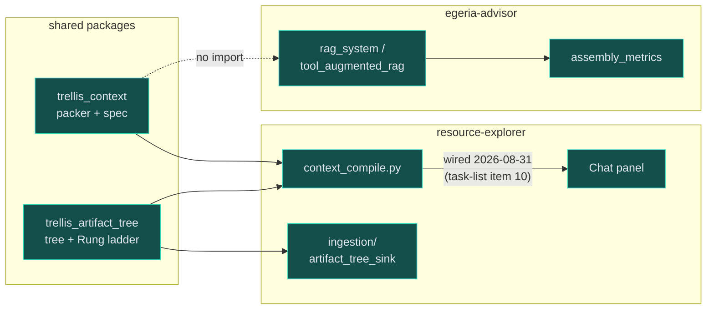
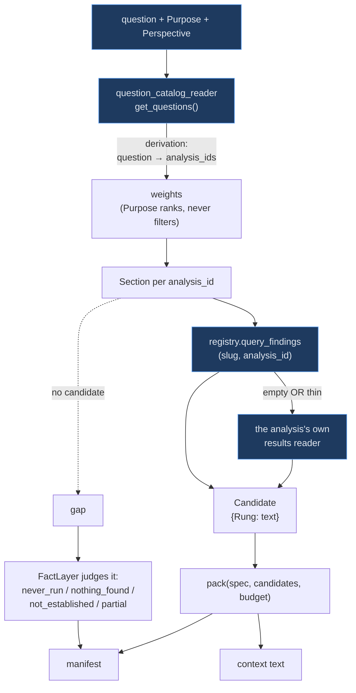
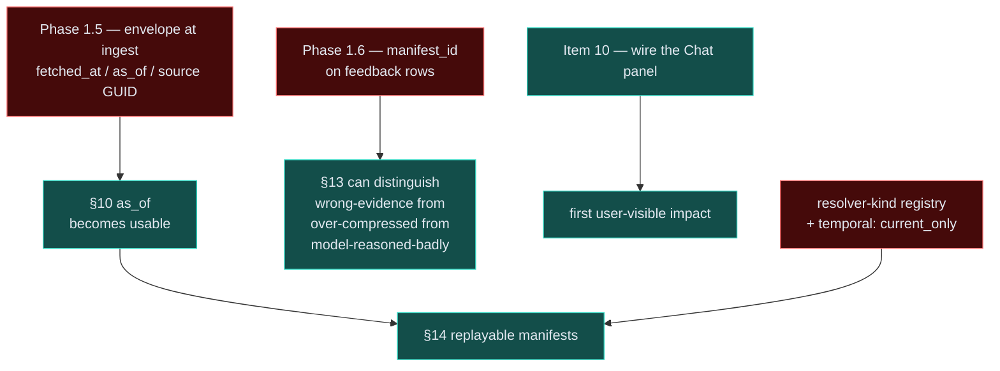
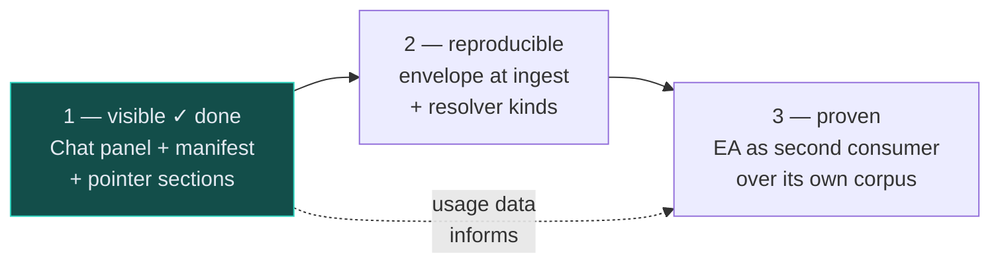

# The context compiler across Trellis — what feeds it, who could use it, and what comes next

**Status:** review, 2026-08-30. Requested as *"how the context compiler notion can be leveraged
across Trellis and what feeds it"*. Everything marked **measured** was checked against the code or
the store; everything marked **proposal** is not built and not decided.

**Update, 2026-08-31: Step 1 (§5) shipped.** The rest of this doc is left as written 2026-08-30 —
including §1's table and diagram, which now understate what exists — because the reasoning is
still the useful part; corrections land as dated notes at the point they apply, same convention
the design doc uses. Short version: the Chat panel went from *"nothing calls `compile_context`
but its own test file"* to being the real answer path — `ConversationAgent` compiles evidence on
every turn, prefers it over `vector_search`, and the same compile now also renders in the panel as
gaps with a **run** button, inline results (tables/charts, not text), pointer sections (a link to a
live view, not just prose), and a packed-text view — collapsed under the real answer rather than a
separate action. Two real correctness bugs in the compiler itself were found and fixed along the
way (§1/§20 both undersold how untested the packer's quality claim was): a reader's real findings
were being flattened to bare counts, and `question` was accepted by `compile_context` and silently
never used to rank anything. §4's "one live hazard" (`architecture_recovery` tagged fast-but-slow)
is also resolved, separately — `availability` is a declared field again, not derived from
`run_time`. EA (§3b) and the reproducibility work (§5 Step 2) are untouched; nothing below about
either one is stale.

Companion to `context-compilation-design.md` (the design) — this is about **reach**: what the
compiler currently touches, what it could, and in what order.

---

## 1. What exists today, measured

| | state |
|---|---|
| `trellis_context` — `ContextSpec`, `Section`, `Candidate`, `pack` | built, 338-line packer, its own tests |
| `trellis_artifact_tree` — the containment tree and `Rung` ladder | built, ~1.6k lines, **wired into RE ingestion** (`ingestion/artifact_tree_sink.py`) |
| `resource_explorer/context_compile.py` — the compile entry point | built, 363 lines, 40 passing tests |
| Phase 0 — derivation trace, coverage report, catalog invariants | done |
| **Anything calling `compile_context`** | ~~nothing but its own test file~~ **2026-08-31: `ConversationAgent._compiled_evidence` and the Chat panel's "Evidence" button, both real** |
| **EA using any of it** | **no imports of `trellis_context` or `trellis_artifact_tree` at all** — still true 2026-08-31, checked directly, not assumed |

So the machine is built and connected to nothing, and the shared package has one consumer.
*(As of 2026-08-31: connected to the Chat panel — see the update above. Still one shared-package
consumer; EA remains unconnected.)*

## 2. What feeds it, measured

A compile is three inputs and one rule. **Nothing is run** — resolvers read stored results only, and
an analysis that has not run produces a *gap*, not a silent absence.

Three things in that picture are load-bearing and easy to miss:

- **The derivation travels with the answer.** *"This section is here because your Purpose is
  Certify, which ranked Q17, which dispatches security_scan."* It is what makes the manifest an
  explanation rather than a list of sizes.
- **The reader fallback is about evidence, not precedence.** The findings table holds results for a
  *minority* of analyses. An earlier version fell back only when findings were empty, so any
  whole-resource row — however slight — suppressed the reader entirely; a single Mermaid diagram row
  replaced an analysis's real results with a picture. It now consults both when findings are thin
  and keeps whichever says more.
- **A gap is judged, not merely reported.** The packer knows only that a section had no candidate.
  The `FactLayer` knows whether that is *a measured zero* or *a never-run*, and those are opposite
  answers to the same question.

## 3. Where the leverage is

The compiler's real claim is not "assemble a prompt". It is:

> **A context is declared, budgeted, explained, and reproducible — and nothing in it was invented at
> assembly time.**

Every place in Trellis that builds an LLM input today does the first part ad hoc and none of the
rest. That is the leverage, and it is worth being concrete about who gains what.

### 3a. RE's Chat panel — the intended first consumer

Task-list item 10, and the design's own words: *"the first point at which the compiler impacts RE.
Everything before it is invisible."* Dan (2026-08-30) settled the doc's open caveat about whether
the panel is used enough to justify it: **it will be used.**

He also added a requirement that changes the output model rather than the UI:

> *"there is no reason why, in some cases, it can't provide a link to an architecture view elsewhere
> as well as providing a textual description."*

A section that resolves to a **pointer** rather than packed text costs almost no budget, stays
correct as data changes, and needs an addressable target — which only became true today, now that
the architecture card has perspective tabs. Backlogged separately.

**Update, 2026-08-31: built.** `trellis_context.Pointer` carries `{resource_slug, view,
perspective, scope, as_of}`, sized at a small constant cost added at every rung (never changes
which rung is chosen), and rendered both into the packed text for the model and structurally for
the Chat panel to draw a real link from. Wired for `architecture_recovery` only
(`context_compile.py`'s `_POINTABLE_VIEWS`) — the one analysis with a real view to point at today,
same deliberate narrowness this note called for. RE still has no URL routing, so "link" means the
panel drives the same client-side navigation a person would click through by hand (select the
resource, switch intent, open the results, select the perspective tab) rather than a real
addressable URL — a further step, not represented as done here.

One caveat surfaced building this that this note did not anticipate: `Pointer.perspective` exists
in the data model but `_pointer_for` never sets it (only `resource_slug`/`view`/`as_of`) — nothing
in `context_compile.py` today resolves *which* architecture perspective tab a given compile should
point at, only that a view exists. The UI code path for jumping to a named perspective is built and
waiting on that; it is presentational readiness, not the same as the pointer being complete.

### 3b. EA — the second consumer, and the one that proves the boundary

**Measured: EA imports neither shared package.** Its assembly is `rag_retrieval` +
`assembly_metrics` + `prompt_templates`, with no budget solve, no compression ladder, no manifest,
and no gap vocabulary. It tracks *what it assembled* (`DocumentAssemblyMetrics`) but cannot state
*what it could not fit* or *what was missing versus merely absent*.

§17 already resolved EA's compile unit: **adopt Investigation, don't invent a concept.** The
adoption is gated on a decision — where the Investigation table lives and who writes it — which is
worth making early even though the work is late.

EA is the useful second consumer precisely because its unit is *different*. One consumer never
proves a boundary; the packer stays honest only if something with a different compile unit and a
different corpus uses the same `ContextSpec`.

### 3c. The artifact tree is already shared and half-used

`trellis_artifact_tree` is wired into RE's ingestion but **not EA's**. Since the tree is the
format-independence boundary — *"a PDF, a docx, a markdown file and a source file all arrive here as
the same shape"* — EA ingesting into it would give both apps one corpus shape and make the rung
ladder meaningful on EA's content too. This is the cheapest cross-Trellis win in the whole review
and it needs no compiler at all.

### 3d. Surveys that call a model

Dan, 2026-08-30: *"a survey is not always deterministic Python — it can include LLM based analysis
as well."* §16 already states the discipline this implies: agent output must be **written down,
versioned and provenance-stamped before it is packable**, because agents are non-deterministic and
§14 asks for byte-identical recompiles.

That makes the guarantee *conditional and precise* rather than weakened:

> same spec + same `as_of` + same **materialized** state → same context

An LLM-based survey step is therefore not a problem for the compiler as long as its output is
materialized first. The decision trace (`architecture_decisions`, built today) is the natural home
for the written-down half.

## 4. What actually blocks it

Ordered by what stops what. **None of these is compiler code.**

**The hazard this section warned about is resolved, 2026-08-31 — not by the panel avoiding it, but
by the field it depended on changing shape.** `availability` derived from `run_time` on 2026-08-30
(the day this review was written); by 2026-08-31 it was reversed back to a **declared** field,
independent of `run_time` (§20's own second look, prompted by exactly this case).
`architecture_recovery` now declares `run_time: fast` (compute really is ~6s) **and**
`availability: queued` (acquisition is not) — two different questions with two different honest
answers, which `run_time` alone could never hold at once. The Chat panel's gap-run button reads
`availability`, not `run_time`, and backgrounds anything `queued` the same way the Analysis card's
own Run button always has — §20's rule ("the packer must never trigger a survey") holds because
the compile path still never calls run at all; only an explicit click does, and it queues rather
than blocking either way.

**`temporal` has no home.** §20 concluded it belongs on **resolver kind**, not on the analysis
catalog — and **no resolver-kind registry exists**, so `current_only` is currently undeclarable
anywhere. A resolver that ignores `as_of` silently mixes current data into a historical compile,
which §10 calls the worst failure mode here *because the output looks coherent*.

## 5. Evolution — three steps, in dependency order

**Proposal, when written. Step 1 is now done (2026-08-31); Steps 2 and 3 are still proposals, not
decided.** Each step is useful alone, which is the test I applied.

### Step 1 — make the compiler visible (RE only) — **done, 2026-08-31**

~~Wire item 10: the Chat panel with a manifest pane. Add the **pointer section** so an
architecture question can answer in prose *and* link to the deployment perspective of the right
resource.~~ Shipped, and past the minimal scope this described: the manifest pane exists as a
collapsed "📎 evidence used" toggle under the real answer (not a separate action), pointer
sections render as clickable links into the architecture card, gaps carry a **run** button that
backgrounds the analysis and then shows its results inline (tables/charts, via the same renderers
the Analysis card uses — not the manifest's own text), and the agent's system prompt now says to
prefer this evidence over `vector_search` rather than silently having discretion to ignore it.

*The usage-data premise this step's ordering rested on has started, not concluded*: a live user
asked real questions the same day this shipped, which is how the two `compile_context` correctness
bugs above got found — that is the "generates the usage data" case working as argued, not evidence
the step is finished tuning. `_question_relevance`'s weighting is a working, safety-bounded
heuristic (reviewed against §3's nesting-safety property), not a claim of being well-tuned; more
real usage would still be the way to find out.

### Step 2 — make it reproducible (envelope + resolver kinds)

Capture `fetched_at` / `as_of` / source GUID at ingest (Phase 1.5), and introduce the resolver-kind
registry so `temporal: current_only` is declarable and a mixed compile is *marked* rather than
quietly packed.

*Why second:* it is what turns the manifest from something you can read into something you can
re-execute — §11's distinction between an assertion and an audit — and it needs no second consumer.

### Step 3 — prove the boundary (EA as second consumer)

Settle §17's gating decision (where Investigation lives, who writes it), have EA ingest into
`trellis_artifact_tree`, and give EA a `ContextSpec` over its own corpus.

*Why last, and why it matters:* a shared package with one consumer is a shared package by
aspiration. EA's compile unit and corpus are genuinely different, so it is the thing that would
find the places where `ContextSpec` accidentally encodes RE's assumptions.

## 6. Honest limits of this review

- ~~**No usage data exists.**~~ **2026-08-31: it does now, a little.** One day of real questions
  against Step 1 found two real correctness bugs in the compiler itself (a reader's findings
  flattened to bare counts; `question` silently unused in ranking) that 40-plus tests over
  synthetic fixtures had not caught. That is the case for Step 1 first, working — not evidence the
  packer is now well-understood at scale, which is still one day, one user, one resource type.
- **EA was read, not run.** The claim that it has no budget solve or manifest is from reading
  `rag_retrieval`, `assembly_metrics` and `tool_augmented_rag` and finding no imports of the shared
  packages — not from tracing a live query. Still true 2026-08-31; nothing touched EA.
- **The packer's quality is untested at scale.** Real usage found real bugs in one day, which says
  the untested surface was genuinely untested, not that it is now tested. Still no real budget
  packed against a real corpus under sustained, varied contention — one session's worth of manual
  questions is a start, not that.
