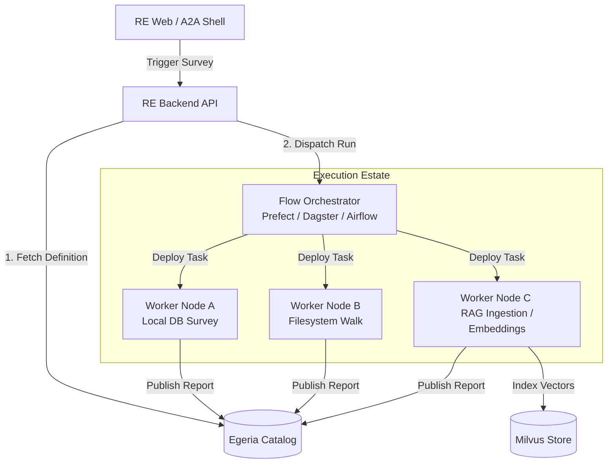
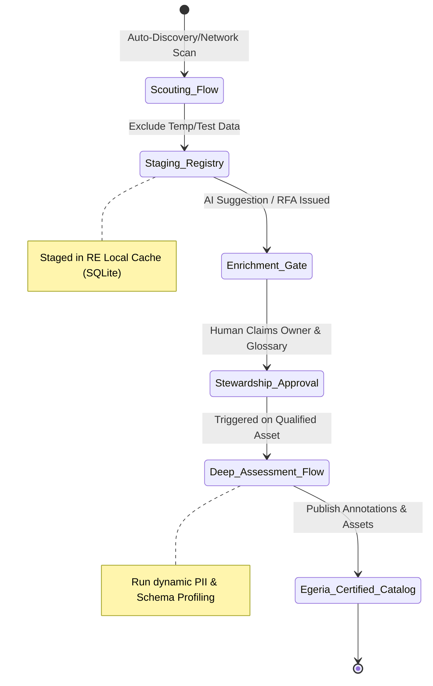
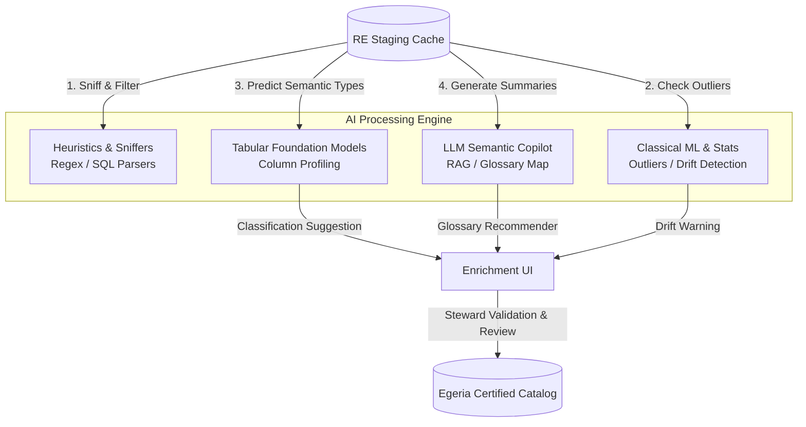

# Architectural Discussion: Distributed Survey Orchestration in Resource Explorer

**Date:** 2026-07-14
**Status:** Proposal / Design Options

This document explores the architectural feasibility, benefits, and design options for integrating a modern workflow orchestrator (such as **Prefect**, **Airflow**, or **Dagster**) into Resource Explorer (RE) to drive distributed, estate-wide surveying.

---

## 1. Why Integrate a Flow Tool?

Currently, RE uses a simple daemon thread (`scheduler.py`) that executes surveys synchronously on the host where RE runs. While Egeria is fully capable of running as a distributed, heterogeneous metadata ecosystem (via its federated server platforms and connectors), many organizations hesitate to deploy Egeria infrastructure components directly into every secure enclave or close to all their database/file assets. 

Integrating existing enterprise workflow engines (Prefect, Airflow, Dagster) with Egeria provides a trusted, pre-approved path to drive surveys locally at the assets and push the findings back to the central catalog.

Introducing a flow tool provides:

1. **Distributed Execution:** Survey tasks can run on remote workers close to the target resources (e.g., databases inside private VPCs, local filesystem edge agents).
2. **Resilience & Fault Tolerance:** Automatic retries, rate limiting, execution timeouts, and backoff strategies for database/filesystem queries.
3. **Resource Scaling:** Dynamically scaling compute up or down (e.g., spawning Kubernetes jobs for heavy data profiling or embedding generation, and tearing them down after).
4. **Dynamic DAGs:** Surveying a database or filesystem structure first, and dynamically spawning parallel downstream profiling tasks for each discovered sub-resource (schema/table/large folder).

---

## 2. Conceptual Architecture

We distinguish two separate orchestration use cases for Resource Explorer:

1. **Extending the Reach (Distributed Estate):** Leveraging existing enterprise-deployed flow engines close to protected assets to perform the surveying work, acting as agent bridges back to Egeria.
2. **Local Execution Unification (Local Dependency):** Instead of RE running custom daemon loops in `scheduler.py` or writing ad hoc execution threads in `SurveyOrchestrator`, RE can establish a hard dependency on a local flow engine (e.g., Prefect core running locally) to orchestrate even local runs. This unifies local and remote runtimes, giving us consistent retry mechanics, telemetry, and task visibility out-of-the-box.

In both use cases, the orchestrator sits between **Resource Explorer's A2A/Web interface** and the **underlying infrastructure**, acting as the execution engine. Egeria remains the catalog of record, while the flow tool handles the physical scheduling and running of execution graphs.

---

## 3. Comparison of Flow Tools

Choosing the right tool depends on whether we prioritize asset lifecycle, ease of dynamic Python execution, or legacy enterprise integration:

| Dimension | Prefect (Recommended) | Dagster | Apache Airflow |
| :--- | :--- | :--- | :--- |
| **Orchestration Model** | Dynamic, code-first, imperatively triggered. | Declarative, Asset-oriented (Software-Defined Assets). | Static DAGs, task-oriented. |
| **Ease of API Triggering** | **High:** Lightweight REST API and SDK. Easy to launch flows on-demand from FastAPI. | **Medium-High:** GraphQL API. Fits asset-centric workflows well. | **Medium-Low:** Heavily schedule-centric. Dynamic parameters can be clunky. |
| **Deployment Footprint** | Extremely lightweight. Can run serverless/agents or self-hosted. | Moderate. Requires daemon services and workspace files. | Heavy. Requires database, scheduler, webserver, and workers. |
| **Egeria / Metadata Alignment** | **Good:** Acts as a pure task runner. Egeria handles the asset states. | **Excellent:** "Assets-first" model maps 1:1 onto Egeria's catalog structures. | **Fair:** Focuses strictly on tasks/DAGs rather than the underlying data assets. |
| **Hybrid Execution** | **Excellent:** Prefect Agents/Workers pull work from a central queue over HTTPS. | **Good:** Dagster agents run in user code spaces. | **Fair:** Celery/Kubernetes executors require direct network routing. |

---

## 4. Proposed Integration Patterns

To incorporate a flow tool without breaking Egeria-first principles, we can employ three main patterns:

### Pattern A: `executes_at` Routing (The Unified Extension)
Following RE's existing Survey Definitions design, the `executes_at` key in a Governance Action Step determines the execution engine:
* `executes_at: resource-explorer` $\rightarrow$ Run in-process using local surveyors.
* `executes_at: egeria` $\rightarrow$ Hand off to Egeria's native Java survey engine.
* `executes_at: prefect` (or `dagster`) $\rightarrow$ RE's executor dispatches the job to the flow tool via its REST API (passing the asset GUID, connection reference, and survey parameters).

### Pattern B: The Flow Tool as an Egeria Connector
Instead of RE orchestrating the flow tool, we implement a custom Egeria connector on the Java side that delegates to Prefect or Dagster.
* When Egeria executes a Survey Action, it calls the connector.
* The connector starts a workflow in the flow tool.
* Once complete, the workflow publishes the annotations back to Egeria.

### Pattern C: The "Software-Defined Assets" (SDA) Bridge (Dagster Special)
Since Dagster is built around Software-Defined Assets (defining the data assets that a pipeline produces), we can generate a Dagster Workspace dynamically by reading Egeria's catalog.
* Egeria represents the authoritative asset catalog.
* Dagster reads Egeria's assets to define its asset graph.
* Running a Dagster pipeline automatically syncs data profiles, schemas, and metadata back to Egeria.

> [!WARNING]
> **Exploratory Discovery Mismatch:** Dagster's SDA model is highly literal and expects assets to be pre-declared and defined in code before run time. In contrast, RE's core discovery workflow is exploratory (Discover $\rightarrow$ Survey $\rightarrow$ Select $\rightarrow$ Catalog). When starting a survey, we often only have a top-level entry point (like a filesystem root or server connection), from which we dynamically discover nested assets that we may or may not decide to catalog. Generating static SDA schemas dynamically for undiscovered assets is highly complex, making task-centric engines like Prefect a much better fit for exploratory phases.

---

## 5. Recommendation

For Resource Explorer, **Prefect** offers the lowest friction and highest immediate value:
1. **Dynamic Task Mapping:** Easily walks a filesystem directory, discovers 5 huge CSVs, and dynamically maps 5 parallel profiling tasks.
2. **Hybrid / Distributed Agents:** A user can run a lightweight Prefect agent on a local laptop or database server. This agent pulls work from the central RE server, bypassing firewalls and security rules that would otherwise prevent the central RE server from directly accessing the database.
3. **Pythonic Simplicity:** Wrapping RE's existing sub-surveyors in `@flow` and `@task` decorators requires minimal code changes.

---

## 6. Architecture of the Progressive Intake & Enrichment Funnel

Integrating a flow engine allows RE to implement a structured, progressive governance lifecycle—moving from broad estate discovery to deep, selective metadata certification.

### 6.1 Phase 1: The Scouting Flow (Broad Estate Discovery)
* **Goal:** Inventory all active servers, ports, cloud object stores, and filesystem paths.
* **Orchestrator Role:** Run scheduled, lightweight network/cloud scanning tasks on remote agents. 
* **Data Minimization:** Exclude temporary directories, scratchpads, and dead connections. Write discovered candidates to the local **RE Staging Registry** as `Unclassified Candidates` rather than polluting Egeria's catalog.

### 6.2 Phase 2: The Enrichment Gate (Human Attribution)
* **Goal:** Establish ownership and security classifications.
* **Orchestrator Role:** Staged candidates trigger a metadata classification check. If anomalies or missing attributes (owner, data type) are found, RE issues an Egeria `ToDo` task (RFA).
* **AI Support:** The Enrichment UI suggests owner assignments and glossary tags based on schema patterns. Once the human steward approves/enriches the metadata, the asset is qualified for deep assessment.

### 6.3 Phase 3: The Deep Assessment Flow (Progressive Curation)
* **Goal:** Perform deep column profiling, semantic mapping, and compliance scans.
* **Orchestrator Role:** Triggers a dynamic Prefect/flow-run targeted *only* at the qualified, steward-approved assets. 
* **Security Control:** The flow reads the asset's human-supplied classification. If marked "PCI-Restricted", the flow engine skips row sampling to prevent data leakage and triggers specialized encryption checks.

### 6.4 Phase 4: Certification (Egeria Publish Gate)
* **Goal:** Promote qualified metadata to the central catalog of record.
* **Orchestrator Role:** Post-assessment tasks push the detailed annotations and schema structures to **Egeria's Certified Catalog** via the `EgeriaPublisher`, locking in the governance history and lineage.

---

## 7. The Federated AI & Human Collaboration Layer

The architecture integrates four distinct tiers of automated/artificial intelligence with human-in-the-loop validation, mapping directly to execution blocks in the progressive funnel:

* **Intake Filtering (Deterministic Heuristics):** Runs in the remote flow worker container. Sniffs file extensions, calculates hashes, and runs SQL parsing rules to filter out temporary/scratch spaces at the edge.
* **Outlier & Drift Detection (Classical ML):** Evaluated by local scheduler tasks. Runs statistical Z-score checks on connection rates, row-count changes, or file counts to identify anomalies, feeding warnings to the Enrichment view.
* **Semantic Column Profiling (Tabular Foundation Models):** Runs inside the Deep Assessment pipeline. Uses pre-trained tabular network inference (e.g., TabPFN) to analyze value distributions (ranges, cardinalities, numeric densities) to predict PII types, bypassing brittle regexes.
* **Context Synthesis & RAG Mapping (LLM Agents):** Triggered asynchronously. Summarizes technical database structures, parses project READMEs, and generates recommended links to Egeria glossary terms.
* **The Final Decision Gate (Human Judgement):** The A2A and Web UI collect recommendations from the Tabular FM and LLM agents and present them as interactive forms. The human steward's approval promotes the metadata from RE Staging to the Egeria Certified Catalog.

---

## 8. Temporal Data Architecture & Visualizations

To assist human judgement, the system must visualize changes and drifts over time. The architecture leverages Egeria's native dual-temporal capabilities:

### 8.1 Dual-Temporal Metadata Modeling
Egeria stores metadata with two distinct timelines, which the RE backend queries:
1. **System Time (Transaction Time):** Tracked automatically by Egeria's repository handlers. This allows RE to execute **Point-in-Time (As-Of) Queries** to fetch the exact catalog state at a specific past date/time.
2. **Effective Time (Business Time):** Specified in the API properties. This tracks when a classification, owner assignment, or glossary term linkage is valid in the business domain.

### 8.2 Historical Data and Visual Diffing Engine
The RE Web UI employs three temporal visualizers to support steward judgment:

* **Schema Drift Timeline:** A visual changelog that queries Egeria's repository for the system-time history of an asset, performing a structural `diff` between snapshots. It renders columns added, tables removed, or data types modified as color-coded timeline nodes.
* **Activity & Capacity Trends:** Tracks database row-count and file-system volume metrics stored historically in RE's SQLite cache, plotting growth rates against connection/write activity to highlight un-governed data creep.
* **Stewardship Velocity Dashboard:** Visualizes the duration assets spend staged in `Unclassified` vs `Certified` states over time, allowing managers to identify where AI-copilot auto-suggestions are most needed.

---

## 9. Immediate Action Plan

1. **Flow Tool Adapter:** Create an adapter in `resource_explorer/surveyors/` for the chosen flow tool (e.g., `prefect_adapter.py`).
2. **Staged Candidate Support:** Update `resource_explorer/registry.py` to support staging states (`unclassified_candidate`, `qualified_candidate`, `certified`).
3. **Survey Definition Routing:** Update the Survey Definition executor to recognize `executes_at: prefect` and route execution to the Prefect API.
4. **Task Packaging:** Package RE's sub-surveyors as reusable Python tasks (`@task`) that can be executed either locally or by remote flow workers.
5. **Asof Query Support:** Add Egeria As-Of/Effective Time parameters to the `EgeriaReader` query endpoints to drive visual history diffs.
6. **AI Recommendations Engine:** Wire the local LLM agent and tabular classification outputs into the Enrichment API to serve suggestions to the frontend.
