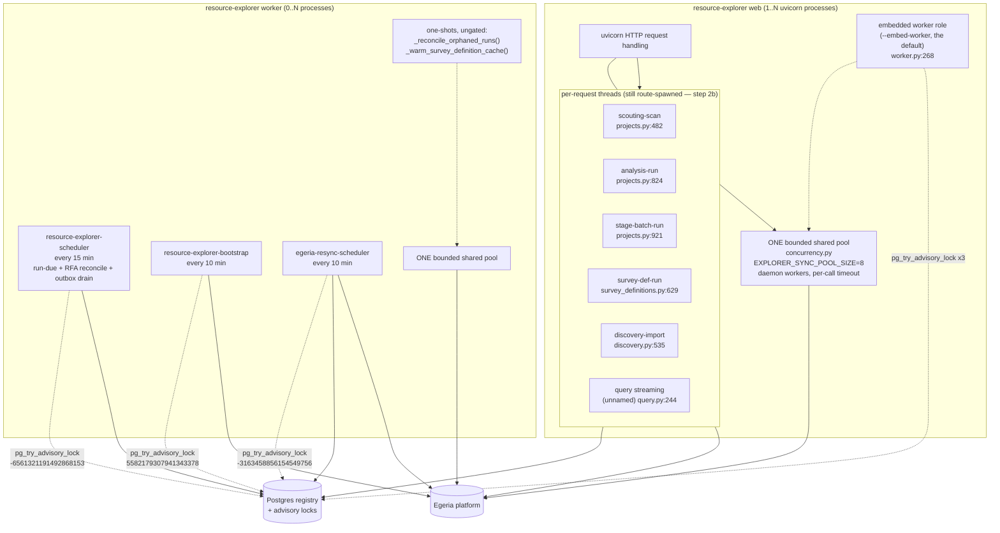
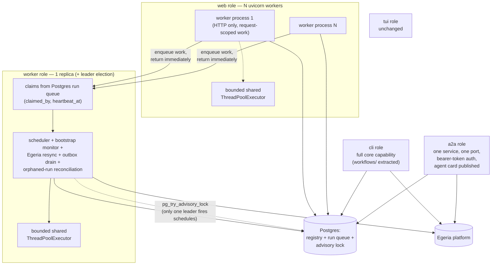

# Resource Explorer — Process & Threading Model

**Added 2026-09-04**, per `docs/runtime-architecture-plan.md` §Sequencing step 1: "Write RE's
threading and process-role model into `docs/Architecture.md`" — this is that write-up, split into
its own file because `Architecture.md` was already dense (see that file's linked pointer). It
preceded, and was a precondition for, the process-role refactor in the plan's step 2. **Rewritten
2026-09-04 after step 2a landed** — Part 1 describes what runs now, not what ran before it. Do not
start step 2b from memory of this document — re-read the current-state sections against the code
first, since this is a snapshot, not a contract the code is held to. Step 2a's own findings F6 and
F7 were both things this document got wrong or did not know until the code was built.

Two parts: **current state** (what runs today, verified against the code, cited file:line) and
**target state** (restated from the plan, not redesigned here). A migration map closes the gap.

---

## Status: step 2a landed, 2026-09-04

This document was written *before* the refactor and described a single process with five
lifespan-started loops and six ad hoc thread pools. **Step 2a of the plan has since landed**, and
Part 1 below has been rewritten to describe what runs now, not what ran then. What moved:

| Moved | From | To |
|---|---|---|
| All three always-on loops, plus both startup one-shots | `web/app.py`'s FastAPI lifespan | `resource_explorer/worker.py`'s `run_worker()`, reached by `resource-explorer worker` or by `web`'s `--embed-worker` |
| "Exactly one process runs each loop" | nothing enforced it (Finding F2) | `pg_try_advisory_lock` per loop, `resource_explorer/leader_election.py` |
| Six ad hoc `ThreadPoolExecutor`s, one of them uncapped | scattered across six call sites | one bounded shared pool, `resource_explorer/concurrency.py` |
| SIGUSR1 thread dump + bounded shutdown | the `web` command only | `_install_stack_dump()`, shared by `web` and `worker` (`cli/main.py:318`) |
| `nest_asyncio` | imported and `apply()`-ed by RE | not imported by RE at all; pyegeria still applies it for its own reasons |

**Still pending — step 2b, deliberately not started here:** the Postgres run queue with
`claimed_by`/`heartbeat_at`, extraction of the analysis-run/discovery/curate workflows out of the
route modules, the `a2a` role, and `trellis-auth` adoption. Per-request background threads (§1.2)
therefore still spawn from route handlers exactly as they did.

---

## Part 1 — Current state

Resource Explorer is now **two process roles over one codebase**: `resource-explorer web` (one or
more `uvicorn` processes serving HTTP) and `resource-explorer worker` (every always-on background
loop). `web --embed-worker` — still the default, so `make dev` is one command — runs the worker
role in a daemon thread inside the web process. Which process actually *runs* a given loop is
decided by a Postgres advisory lock, not by which one was started first, so a second RE process
against the same registry stands by instead of duplicating work.

What has NOT changed: an unbounded number of ad hoc per-request threads spawned by route handlers
(§1.2) — those wait on step 2b's run queue.

### 1.1 The background loops and where they live

All of them are started from `run_worker()` in
`packages/resource-explorer/resource_explorer/worker.py:201`. `web/app.py`'s `_lifespan`
(`web/app.py:43`) starts **nothing** of its own; it either spawns the embedded worker or logs that
it did not (`web/app.py:20`, `_embed_worker_enabled`).

```
run_worker(embedded=?, stop_event=...)          # worker.py:201
  _reconcile_orphaned_runs()                    # worker.py:116  one-shot, ungated
  _warm_survey_definition_cache()                # worker.py:134  one-shot, own daemon thread, ungated
  for spec in loop_specs():                      # worker.py:108
      threading.Thread(_supervise, ...)          # worker.py:162  one per loop: win the lock, start it, hold
  stop_event.wait()                              # returns on SIGTERM/SIGINT or lifespan shutdown
  join supervisors within shutdown_timeout       # default 15s, daemon threads so exit never blocks
  concurrency.shutdown(wait=False)               # detach abandoned pool workers — see §1.3
```

| Thread (name) | Source | Loop interval | Advisory key | What it iterates / does | What it writes |
|---|---|---|---|---|---|
| `resource-explorer-scheduler` | `scheduler.py:84` (`start_scheduler`), loop `scheduler.py:132` (`_scheduler_loop`), stopped by `scheduler.py:109` (`stop_scheduler`) | `_CHECK_INTERVAL_SECONDS = 900` (15 min), `scheduler.py:77` | `scheduler` → `-6561321191492868153` | Three things per tick, in order: (1) `_run_due()` (`scheduler.py:286`) — analyses whose `resource_schedules.next_run` has passed, same-repo due surveys coalesced into one orchestrator call to avoid double-downloading a zipball; (2) `_reconcile_rfa_actions()` (`scheduler.py:158`, docs/rfa-egeria-todo-followup.md); (3) `_drain_egeria_outbox()` (`scheduler.py:170`, docs/outbox-publishing-design.md §5) — **this is where the outbox drain lives**; still not a separate loop (Finding F1) | `resource_schedules.next_run`/`last_run_status`, an `ActivityEntry` per run, `rfa_actions` rows, outbox rows via `drain_outbox`, plus `registry.purge_outbox_completed()` retention |
| `resource-explorer-bootstrap` | `bootstrap.py:520` (`start_scheduler`), loop `bootstrap.py:509` (`_loop`) | `CHECK_INTERVAL_SECONDS = 600` (10 min), `bootstrap.py:120`; first pass runs immediately, inside the thread | `bootstrap-monitor` → `5582179307941343378` | `check_and_heal(docs_dir)` — detects and repairs Dr.Egeria definitions (glossaries, perspectives, Question terms, Survey Definitions) wiped by an Egeria reset | Recreates missing Dr.Egeria elements in Egeria; no local table write in the loop itself |
| `egeria-resync-scheduler` | `egeria_resync.py:1254` (`start_scheduler`), loop `egeria_resync.py:1224` (`_loop`) | `CHECK_INTERVAL_SECONDS = 600` (10 min), `egeria_resync.py:1166` | `egeria-resync` → `-3163458856154549756` | `scan_and_clear()` (`egeria_resync.py:1185`) — clears stale Egeria pointers left by a repository-store wipe, applying only `SAFE_SCHEDULED_STEPS` whose findings are present, re-checking `needs_decision`/`EXPENSIVE_STEPS` as defense in depth | In-process `_status` dict read by the admin banner, plus whatever `resync.apply()` clears |
| `survey-cache-warm` | `worker.py:134` (`_warm_survey_definition_cache`) | one-shot, not a loop | **none — deliberately ungated** | `SurveyDefinitionReader().warm_question_guid_cache()`; failures swallowed (best-effort) | Module-level `_question_guid_cache` / `_candidates_cache` dicts in `survey_definition_reader.py`, which die with the process |

**Why the two one-shots take no lock**, which is easy to "fix" wrongly in both directions:

- `_reconcile_orphaned_runs()` (`worker.py:116`, calling `run_reconciler.reconcile()`) judges
  ownership **per row** — pid liveness plus a matched process start time — so it is already safe
  in every process, and electing a single leader for it would make it *less* useful, not safer.
- `_warm_survey_definition_cache()` (`worker.py:134`) fills a **process-local** dict. A leader
  would warm one process's cache and leave every other one cold, which is the opposite of the
  point.

**Fixed in passing (a real bug, not a refactor artifact):** the old
`_warm_survey_definition_cache()` in `app.py` was decorated `@asynccontextmanager` while being a
plain synchronous function. Calling it therefore constructed a context-manager object and **never
executed the body**, so the cache warm had silently not happened since that decorator was added —
every restart charged the first user of each phase for its cold lookups, which is precisely the
symptom the warm was written to remove. It runs now: verified live 2026-09-04, "survey-definition
cache warmed: 51 question(s) checked, 48 resolved, 10 definition(s) prefetched, 0 failed".
The failure was invisible from the outside because the warm is best-effort by design — nothing
downstream distinguishes "warmed and found nothing" from "never ran".

### 1.1a Leader election

`resource_explorer/leader_election.py`. One `LeaderLock` per loop (`leader_election.py:77`),
each holding **its own** connection (`NullPool`) for the life of the process, because
`pg_try_advisory_lock` is session-scoped: the lock lives as long as the connection does, and
Postgres drops it automatically when that connection goes — a killed worker frees its locks with
no janitor. The connection is set autocommit (`leader_election.py:106`, `acquire`) so it does not
sit `idle in transaction` for hours blocking vacuum on the shared instance; that was observed
live before the fix.

Keys are **derived, not chosen**: `blake2b(f"{KEY_NAMESPACE}:{name}", digest_size=8)` read as a
signed big-endian int64 (`leader_election.py:69`, `advisory_key`), with
`KEY_NAMESPACE = "resource-explorer/worker"`. The three values are in the table above and are
pinned by `tests/test_process_roles.py::TestAdvisoryKeys::test_keys_are_stable` — a namespace
change would otherwise let an old and a new process each become leader of their own key across a
rolling restart and both run every loop, which presents as duplicated work rather than as an
error. `python -m resource_explorer.leader_election` prints them.

A loop that loses logs `worker loop standby: name=… leader=false advisory_key=…` and retries at
its own interval, so leadership transfers on its own when the holder exits. A loop that wins logs
`worker loop started: name=… interval=…s leader=true advisory_key=… embedded=…`. Those two lines
are the only way to tell from the outside which process owns what — `make ps` cannot, because an
embedded worker looks exactly like a plain web process.

**Non-Postgres registries:** the registry is Postgres-only now (plan §3 retires the SQLite
fallback). A `LeaderLock` built against a `sqlite://` URL logs a warning and **grants**
leadership (`leader_election.py:113`) rather than crashing — a single-process SQLite setup has no
peer to lose an election to. No SQLite locking is implemented or intended.

### 1.2 Ad hoc per-request threads

None of these are daemon-thread singletons; each is spawned fresh per HTTP request that triggers
it, always `daemon=True`, and the request handler returns immediately (`{"status": "started",
"activity_id": ...}`) while the thread does the work.

| Route / trigger | Thread name | File:line (spawn) | What it does | Ownership / completion recorded | Crash behavior |
|---|---|---|---|---|---|
| `POST` scouting scan (`projects.py`) | `resource-explorer-scouting-scan` | `web/routes/projects.py:482-486` | Runs `_run_scouting_scan_background` — a fast repo scan | `activity_log` row via `log_survey(...status="running"...)` (`projects.py:~470`), **no `runner`/`_runner` recorded** — `log_survey` takes no `runner` kwarg (only `log_analysis_run` does, `activity_logger.py:80-119`) | If the process dies mid-run, the row is left `status="running"` with no owner in `detail`. `run_reconciler.reconcile()` falls back to its age heuristic for rows with no recorded owner (`run_reconciler.py:170-178`, `_ORPHAN_AGE = timedelta(hours=6)`) — so it is eventually reconciled, but only after 6 hours, not by pid-liveness like the two paths below |
| `POST` single analysis run (`projects.py:_run_single_analysis_sync` region) | `resource-explorer-analysis-run` | `projects.py:824-828` | Runs one analysis's mapped survey steps via `_run_single_analysis_background` | `activity_log` row via `log_analysis_run(...runner=process_identity()...)` (`projects.py:818-820`) — **does** record `{"pid": ..., "started_at": ...}` in `detail._runner` | `run_reconciler.reconcile()` checks `os.kill(pid, 0)` plus a matched process-start-time (`run_reconciler.py:91-113`) — resolved to `interrupted` (not `error`) as soon as the pid is confirmed gone, no 6-hour wait |
| `POST` stage batch run (`projects.py`) | `resource-explorer-stage-batch-run` | `projects.py:921-925` | Runs `_run_stage_batch_background`, all steps for one Funnel stage in one call | Same as above: `log_analysis_run(...runner=process_identity()...)`, analysis_id `__stage_batch__` (`projects.py:913-918`) | Same pid-based reconciliation as single-analysis run |
| `POST` run Survey Definition (`survey_definitions.py`) | `resource-explorer-survey-def-run` | `survey_definitions.py:629-633` | Runs `_run_survey_definition_background` — executes a Survey Definition (GovernanceActionProcess chain) against a resource | `activity_log` row via `log_survey(...detail=json.dumps({"_runner": process_identity(), "survey_definition_ref": ...}))` (`survey_definitions.py:618-623`) — records the runner manually inside `detail` since `log_survey` has no `runner` kwarg | Same pid-based reconciliation via `run_reconciler.owner_of()` reading `detail._runner` (`run_reconciler.py:118-123`) |
| `POST` GitHub org import (`discovery.py`) | `resource-explorer-discovery-import` | `discovery.py:535-540` | Runs `_run_import_batch` from `github/org_importer.py` — queues/imports repos found by discovery, writes to the `scout` activity log as each completes | Per-repo activity log entries written incrementally by `_run_import_batch` itself, not one row per batch | Not reconciled by `run_reconciler.py` at all — that module only resolves rows left `status="running"`; org-import progress rows are written as each repo finishes rather than held `running` for the whole batch, so there is nothing here for the reconciler's ownership model to apply to |
| Chat/query streaming (`query.py`) | unnamed (`threading.Thread(target=_producer, daemon=True)`) | `query.py:244` | Bridges a synchronous `ConversationAgent.handle()` or `RAGSystem.stream()` call into an `asyncio.Queue` the async request handler awaits from (`loop.call_soon_threadsafe`) | **No activity log entry at all** — this is not survey/analysis work, it is the streaming-response mechanism for a single request; the thread's lifetime is bounded by the request | Not tracked by `run_reconciler.py`; if the process dies mid-stream the HTTP connection simply drops, same as any other in-flight request |

Every one of these threads "outlives the request" in the sense the target state's `web` role rule
(`web` "never spawns threads for work that outlives the request") is written against — except the
`query.py` streaming thread, which is closer to per-request request-handling machinery than a
backgrounded job, since it has no independent existence past the HTTP response.

**None of this changed in step 2a**, deliberately: moving these off the request thread requires the
Postgres run queue (`claimed_by`/`heartbeat_at`) that lets a `web` request enqueue and return, and
that is step 2b. So today the `web` role does still violate its own rule — with the practical
consequence that `--workers N` spreads these across worker processes by luck of routing rather
than by design, and that a `--no-embed-worker` web process is still where survey runs execute.

### 1.3 Sync/async bridging — one bounded shared pool

**Was:** six ad hoc `ThreadPoolExecutor`s, five of them constructed per call, one
(`prefect_adapter.py`) with **no `max_workers` at all**, and one pair in
`survey_definition_reader.py` that nested — a pool of up to 8 workers each opening its own
one-worker pool. **Now:** one pool per process, `resource_explorer/concurrency.py`, sized by
`EXPLORER_SYNC_POOL_SIZE` (default 8, which is what `_GUID_RESOLVE_WORKERS` was).

| Site | Then | Now |
|---|---|---|
| `agents/base.py:199` (`_run_agent`) | `ThreadPoolExecutor(max_workers=1)` per call | `run_sync(lambda: asyncio.run(_inner()))` |
| `agents/conversation_agent.py:144` (`_inject`, memory replay) | same, `.result(timeout=10)` | `run_sync(..., timeout=10)` |
| `agents/conversation_agent.py:272` (`_run_persistent`) | same, no timeout | `run_sync(...)` |
| `tui/app.py:292` (`_add_to_memory`) | same, `.result(timeout=5)` | `run_sync(..., timeout=5)` |
| `surveyors/prefect_adapter.py:179` (`run_prefect_step`'s API branch) | `ThreadPoolExecutor()` — **uncapped** | `run_sync(...)` |
| `surveyors/survey_definition_reader.py:475` (`_lookup_question_guid`, split out of `resolve_question_guid`) | one-worker pool per call, abandoned via `shutdown(wait=False)` on timeout | `run_sync(_call, timeout=_QUESTION_GUID_CALL_TIMEOUT_SECONDS)` — the 15s bound kept (`survey_definition_reader.py:68`) |
| `surveyors/survey_definition_reader.py:663` (`_resolve_question_guids`) | `pool.map(self.resolve_question_guid, rest)` — pooled work that opened its own pool | `submit_all(self._resolve_one_pooled, rest)` (`survey_definition_reader.py:732`) — **leaf** work, plus an overall batch deadline (`survey_definition_reader.py:712`) since the shared pool's width is not `len(rest)` |

**The re-entrancy rule the shared pool needs and the throwaway pools did not.** A bounded shared
pool can self-deadlock: a task that submits back into the pool waits on a slot only a task behind
it could free. Two things prevent it — batch callers submit leaf work (the `_resolve_one_pooled`
split above), and `run_sync` detects that it is already running on a pool thread and runs the
callable **inline** instead of submitting (`concurrency.py:264`). Inline execution loses the
per-call timeout, because there is no second thread to abandon; the caller's own wait is what
bounds it. That is the honest trade — an unbounded wait in one already-owned slot beats a
deadlock that stops every slot.

**Abandoned workers cost more than they used to, and that is the point.** On timeout the worker
is abandoned rather than joined (Python threads cannot be force-killed, and joining one blocked in
Egeria's client is exactly the hang being avoided). The old throwaway pool went with it; a slot in
a *shared* pool does not. `concurrency.stuck_worker_count()` reports how many, so a shrinking pool
is observable rather than inferred from things getting slow.

**Shutdown: `wait=False` was a lie, and this is new information.** Found live 2026-09-04 while
verifying the worker role, using the SIGUSR1 dump §1.4 describes: the worker logged "worker role
stopped cleanly", released its advisory locks — and did not exit. The dump showed the main thread
parked in `concurrent.futures.thread._python_exit -> join` behind two pool workers in the exact
`get_guid_for_name -> nest_asyncio -> select()` frame from the incident.

`_python_exit` joins every pool worker regardless of `shutdown(wait=False)`, and CPython's
`_thread_shutdown()` then waits for them because pool workers are not daemon threads. **The old
per-call pools had precisely the same exposure** — `shutdown(wait=False)` never detached anything
— so this is plausibly part of why the original incident needed a `kill -9` after SIGTERM was
ignored for 8+ seconds. Two fixes, both in `concurrency.py`:

- `_spawn_daemon_workers()` (`concurrency.py:185`) creates all the workers up front from a daemon
  thread, because `threading.Thread` inherits `daemon` from its creator and there is no supported
  way to daemonise a thread afterwards. Daemon workers are not waited for.
- `detach_workers()` (`concurrency.py:298`) removes them from
  `concurrent.futures.thread._threads_queues`, which is what `_python_exit` iterates. Private
  name, guarded call: a CPython rename costs the fast exit, not an exception.

Both roles call `concurrency.shutdown(wait=False)` explicitly on the way out (`worker.py`'s
`run_worker` finally block, and `cli/main.py:473` after `uvicorn.run` returns) rather than relying
on `atexit`, which runs *after* the interpreter has already joined those threads.

**The cross-loop hazard itself is still not fixed.** Collapsing the pools does not resolve it —
`get_guid_for_name` still reaches `nest_asyncio.run_until_complete` inside *pyegeria*, and the
worker's own SIGUSR1 dump caught two threads in that frame again on 2026-09-04. What is true is
that RE no longer imports or applies `nest_asyncio` itself (see below), every bridge is now a
fresh `asyncio.run()` in a pool thread, and the per-call bound plus real abandonment mean a hang
degrades to "not found" and cannot hold the process open. The plan's pyegeria concurrency spike is
still the open item.

**`nest_asyncio` is gone from RE.** `surveyors/prefect_adapter.py` was the only module that
imported it, with a module-level `nest_asyncio.apply()` described as enabling nested loops under
Uvicorn. It was removed on both counts: nothing in RE needs loop re-entrancy any more, and it was
redundant anyway — pyegeria declares `nest-asyncio` as its own dependency and applies it at
package import (`pyegeria/view/mermaid_utilities.py:20`, reached from `pyegeria/__init__.py`), so
the global patch is in effect for any process that touches pyegeria whether RE asks for it or not.
The direct dependency is off RE's `pyproject.toml`; the package stays installed transitively.
`tests/test_process_roles.py::TestNestAsyncio` pins all three facts.

### 1.4 SIGUSR1 thread-dump and bounded shutdown

Added the same day as the incident, in the `web` command only. It is now shared by both roles via
`_install_stack_dump(label)` (`cli/main.py:318`), called from `web` (`cli/main.py:396`) and from
`worker` (`cli/main.py:352`). Still **not** applied when the app is launched by other means (e.g.
`uvicorn resource_explorer.web.app:app` directly, bypassing the CLI).

- **On-demand thread dump**: `faulthandler.enable()` plus, where `SIGUSR1` exists,
  `faulthandler.register(signal.SIGUSR1, all_threads=True, chain=False)`. `kill -USR1 <pid>`
  writes every thread's Python stack to stderr. Deliberately on-demand rather than
  `dump_traceback_later()`'s continuous polling, so it costs nothing while idle. **This earned its
  keep during this very refactor** — it is what identified `_python_exit`'s join as the reason a
  cleanly-stopped worker would not exit (§1.3), a cause no amount of reading the shutdown code
  would have suggested.
- **Bounded graceful shutdown**, per role:
  - `web`: `uvicorn.run(..., timeout_graceful_shutdown=10)` (`cli/main.py:470`).
  - `worker`: SIGTERM/SIGINT set the stop event (`cli/main.py:377`); `run_worker` joins its
    supervisors within `shutdown_timeout` (default 15s, `worker.py:201`), logs anything still
    running, and returns — the supervisors are daemon threads, so a stuck one goes with the
    process instead of holding it open.
  - both: `concurrency.shutdown(wait=False)` on the way out, without which a stuck pool worker
    outlasts every bound above (§1.3).

`_reconcile_orphaned_runs()` (now `worker.py:116`) is what makes a `kill -9` survivable for
survey/analysis runs specifically: process death leaves `activity_log` rows `status="running"`
with an owner recorded, and the next worker start resolves them to `interrupted` rather than
leaving them stuck for ever (`run_reconciler.py`).

### 1.5 Prefect: enabled/unreachable handling and the ephemeral-server leak

`surveyors/prefect_adapter.py`'s `run_prefect_step` checks `config.prefect.enabled`
(`PrefectConfig.enabled`, `config.py:248`) before attempting the Prefect API branch at all; on any
exception other than `PrefectFlowRunCancelled` (an unreachable server, a real bug, anything) it
falls back to running the step locally in-process (`prefect_adapter.py:191-200`) — that fallback
path is not the leak.

**The leak** (found live 2026-09-04, per both `config.py:228-240` and `prefect_adapter.py:6-28`'s
comments): with `config.prefect.enabled=True` and no reachable `PREFECT_API_URL`, Prefect's own
client (`prefect.client.get_client()`) starts an **ephemeral subprocess server** rather than
raising, because Prefect's shipped default profile (`profiles.toml`, `active = "ephemeral"`) sets
`PREFECT_SERVER_EPHEMERAL_ENABLED=true` unless an operator's own profile overrides it, and nothing
in RE ever shuts that subprocess down. Thirteen orphaned
`prefect.server.api.server:create_app` uvicorns, some four days old, reparented to `launchd`, were
found this way.

**As read in the code right now, both parts of the fix described in the plan are already present**
(this contradicts this task's briefing, which said the fix was in progress by another agent
concurrently — either it landed during this session or the briefing was already stale; treat the
following as what the code shows, not as a prediction):

- `config.py:248` — `PrefectConfig.enabled` now defaults to `False` (`PREFECT_ENABLED`), with a
  comment dated 2026-09-04 recording that it was `True` from 2026-08-26 to 2026-09-04 and that the
  `True` default is what leaked.
- `prefect_adapter.py:33` — `os.environ.setdefault("PREFECT_SERVER_EPHEMERAL_ENABLED", "false")`,
  set **before** `import prefect` (Prefect reads settings at import time), as a second, independent
  guard against the same leak regardless of `PrefectConfig.enabled`'s default. `setdefault` so an
  operator who deliberately wants ephemeral-server behavior can still override it via their own
  environment.

`resource_explorer/__init__.py` carries the same `setdefault` at **package import**, which is what
makes it hold in every uvicorn child process under `--workers N` — a CLI-only guard would not.
`tests/test_process_roles.py::TestWebLifespan::test_package_import_still_guards_ephemeral_prefect`
pins that.

(The earlier note here about `CLAUDE.md` calling Prefect "default-on as of 2026-08-26" no longer
applies — that file now says off by default.)

### 1.6 Diagram — current process



Exactly one process wins each key. The embedded worker and a standalone worker compete on equal
terms; whoever loses logs `standby` and retries at that loop's interval.

---

## Part 2 — Target state

Restated from `docs/runtime-architecture-plan.md` §2 (Process roles) and §1 (interaction with
threading/multi-user). Not redesigned here — see the plan for rationale and rejected
alternatives. **This is still the target, not a second description of the present**: two of the
five roles (`web`, `worker`) are built and `cli`/`tui` were already real, but `a2a` is untouched,
the run queue does not exist, and `web` does not yet honour its own "never spawns a thread for
work that outlives the request" rule (§1.2). The migration map below says which is which.

**Five process roles, one core, one image: `web`, `worker`, `cli`, `tui`, `a2a`.**

- **`web`** — N `uvicorn` workers. Serves HTTP requests only; never spawns a thread for work that
  outlives the request (the `query.py`-style streaming bridge inside one request/response cycle
  is fine; a backgrounded survey run is not). `--embed-worker` runs the `worker` role in-process,
  for the dev profile's single-command `make dev`.
- **`worker`** — owns every background loop (scheduler, bootstrap monitor, Egeria resync, outbox
  drain, orphaned-run reconciliation) plus long-running survey/analysis runs, pulled from a
  Postgres-backed run queue (a `runs` table with `claimed_by`/`heartbeat_at` — a generalization of
  what `run_reconciler.py`'s pid-based ownership check already approximates, but as a claim taken
  *before* the work starts rather than judged after the fact). One compose replica in the demo
  profile. `pg_try_advisory_lock` leader election is cheap insurance so two workers (or a worker
  plus a `--embed-worker` web process) cannot both fire the same schedule.
- **`cli`** — the existing Typer CLI, at full core capability once the three web-only workflows
  (analysis-run-and-auto-publish, GitHub discovery, curate materialization — plan §3) are
  extracted into `resource_explorer/workflows/` and exposed as commands. "Reduced capability" for
  the CLI means only: no background loops unless a `worker` is running, and no browser-shaped
  features.
- **`tui`** — the existing Textual app, unchanged.
- **`a2a`** — the entry point for other systems. Today's `agentstack_server.py` (RE's A2A surface,
  one port per specialist agent, 8080-8086, no authentication) becomes one service on one port,
  agents routed by path, the same Egeria bearer token (plan §4) accepted on every call, with a
  published agent card per app.

**Process-management rules that come with the roles** (plan §2): no library starts a server on its
own (`PREFECT_ENABLED` defaults `False`, `PREFECT_SERVER_EPHEMERAL_ENABLED=false` set in every
profile — already true in the code today, see §1.5 above); every long-running unit of work has a
row recording who owns it, when it last heartbeated, how to kill it; every process answers
`SIGUSR1` with a thread dump and shuts down within a bound (**done for `web` and `worker`**,
`cli/main.py:318`; `a2a`/`cli`/`tui` still lack it); `make ps` lists every trellis-owned process
and container with role, pid, age and port (**done**, root `Makefile`).

**One bounded shared `ThreadPoolExecutor` per process** for sync-pyegeria bridging, replacing
today's many ad hoc single-purpose pools. **Done** — `resource_explorer/concurrency.py`, §1.3 —
with the per-call timeout kept. The pyegeria thread-safety spike this was supposed to follow has
**not** happened; the cross-loop hazard is contained, not fixed, and step 2a's own live run caught
two threads in that frame again.

### Diagram — target process topology



---

## Migration map — what is done, what is pending

Step 2a is done; step 2b is the run queue and the workflow extraction.

| Current thread / pool | Moves to | Status |
|---|---|---|
| `resource-explorer-scheduler` (`scheduler.py`) — run-due, RFA reconcile, outbox drain | `worker` role, leader-elected | **Done.** Moved as one unit, per F1 — the outbox drain kept the scheduler's 15-minute cadence rather than getting its own, since nothing showed it needed one. `scheduler.py` also gained the `stop_scheduler()` it had always lacked (`scheduler.py:109`) |
| `resource-explorer-bootstrap` (`bootstrap.py`) | `worker` role | **Done**, leader-elected |
| `egeria-resync-scheduler` (`egeria_resync.py`) | `worker` role | **Done**, leader-elected |
| `survey-cache-warm` (one-shot) | `worker` role — the earlier note flagged "or `web`'s own startup too, not specified in the plan" | **Done, and the open question settled:** it runs in the worker role only, **ungated**, because the cache is process-local. A `--no-embed-worker` web process therefore pays its own first-click lookups; that is the accepted cost of the split, and it is the only behaviour in this refactor that a user could notice. It also had to be *fixed* to move at all — see §1.1's `@asynccontextmanager` bug |
| `_reconcile_orphaned_runs()` one-shot | `worker` role's startup, eventually generalized to run-queue rows | **Moved; not generalized.** Still pid-based (`run_reconciler.py`); the `claimed_by`/`heartbeat_at` version is step 2b |
| Per-request threads: scouting scan, analysis run, stage-batch run, survey-def run, discovery import (§1.2) | `worker` role, via the Postgres run queue | **Pending — step 2b.** Unchanged; still route-spawned |
| Per-request query-streaming thread (`query.py:244`) | Stays in `web` | **Done by staying put** — request-scoped, not backgrounded work |
| `agents/base.py`, `conversation_agent.py` ×2, `tui/app.py` one-worker pools | One bounded shared pool per process | **Done** (§1.3's table) |
| `prefect_adapter.py`'s unbounded per-call `ThreadPoolExecutor()` | Same shared bounded pool | **Done** — the uncapped construction is gone |
| `survey_definition_reader.py`'s two pools — the incident hazard | Same shared bounded pool, per-call timeout kept | **Done**, plus the nesting removed (leaf work submitted instead of pooled work that pooled again) and a batch-level deadline added. **The cross-loop hazard itself is still open** — it lives in pyegeria, and the plan's concurrency spike has not happened |
| `cli/main.py`'s SIGUSR1 + bounded-shutdown instrumentation (`web`-only) | Every role | **Done for `web` and `worker`** (`_install_stack_dump`, `cli/main.py:318`). `a2a`, `cli` and `tui` still do not have it |
| RE's `agentstack_server.py` (8080-8086, unauthenticated) | `a2a` role | **Pending — step 2b/beyond.** Untouched |
| — | `trellis-auth` adoption in RE | **Pending.** Out of scope for 2a |

## Findings that contradict or refine the plan's description (summary)

- **F1 — still true, and it shaped the refactor.** The plan's Context text implies "outbox drain"
  is a background loop parallel to "scheduler". It is not; it is one of three things
  `scheduler.py`'s single loop does per 15-minute tick, alongside RFA reconciliation
  (`scheduler.py:132`). It therefore moved to the worker role as part of the scheduler's move and
  shares its single advisory lock, rather than getting a key and a cadence of its own — nothing
  observed suggests it needs them.
- **F2 — closed.** None of the three loops took any lock; two RE processes sharing one Postgres
  ran all three redundantly, which `run_reconciler.py`'s own docstring calls routine during
  development. `pg_try_advisory_lock` leader election now enforces one leader per loop
  (§1.1a), verified live 2026-09-04: a standalone worker held all three keys while a
  `--no-embed-worker` web process on 8811 held none, and a second worker started against the same
  registry logged `standby` for all three without starting anything.
- **F3 — unchanged.** The Prefect ephemeral-server-leak fix (`config.py`'s `False` default and the
  `PREFECT_SERVER_EPHEMERAL_ENABLED` `setdefault` guard) was already in the tree. `__init__.py`'s
  copy of the guard is what makes it hold in every uvicorn worker process, which matters more now
  that `--workers N` is a supported flag; `tests/test_process_roles.py` pins it.
- **F4 — still open.** `packages/resource-explorer/CLAUDE.md`'s Setup section has since been
  updated to say Prefect is off by default, so the specific staleness F4 named is gone; the
  file's process description ("one process, threads at startup") is now the stale part.
- **F5 — still open, and step 2b's job.** `log_survey()` has no `runner` parameter while
  `log_analysis_run()` does, so a crashed scouting scan is reconciled by the 6-hour age heuristic
  rather than by pid-liveness. The uniform run-queue table closes this by construction; nothing
  in step 2a touched it.
- **F6 (new, found by building this) — `wait=False` did not mean what every pool site assumed.**
  CPython joins pool workers at interpreter shutdown regardless, so an abandoned worker stuck in
  pyegeria held the process open past every timeout — including a worker that had already logged a
  clean stop and released its locks. This was true of the *old* per-call pools too, which makes it
  a plausible contributor to the original incident's "SIGTERM ignored 8+ seconds, needed `kill
  -9`". Fixed in §1.3; found only because the SIGUSR1 dump added during the incident was pointed
  at the new worker.
- **F7 (new) — the survey-definition cache warm had silently never run.** `@asynccontextmanager`
  on a plain sync function meant calling it built an object and executed nothing. Invisible from
  outside because the warm is best-effort and nothing distinguishes "warmed, found nothing" from
  "never ran". See §1.1.
