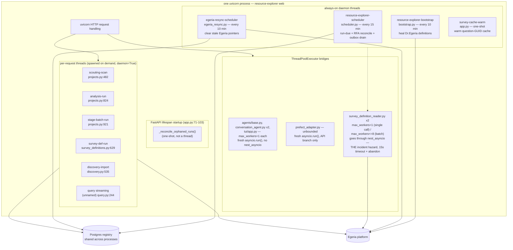
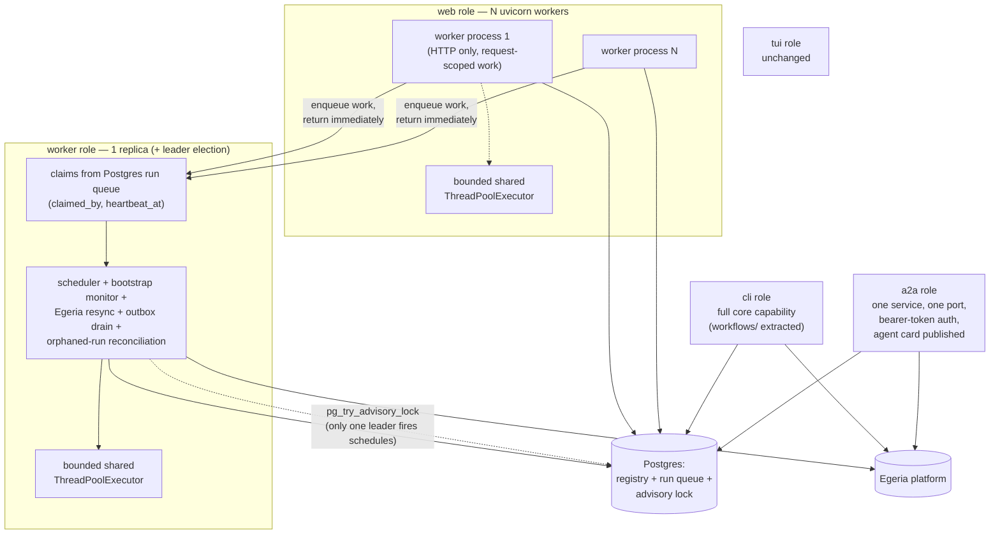

# Resource Explorer — Process & Threading Model

**Added 2026-09-04**, per `docs/runtime-architecture-plan.md` §Sequencing step 1: "Write RE's
threading and process-role model into `docs/Architecture.md`" — this is that write-up, split into
its own file because `Architecture.md` was already dense (see that file's linked pointer). It
precedes, and is a precondition for, the process-role refactor in the plan's step 2. Do not start
that refactor from memory of this document — re-read the current-state section against the code
first, since this is a snapshot as of the commit noted per section, not a contract the code is
held to.

Two parts: **current state** (what runs today, verified against the code, cited file:line) and
**target state** (restated from the plan, not redesigned here). A migration map closes the gap.

---

## Part 1 — Current state

Today, Resource Explorer is **one process** (`resource-explorer web`, i.e. one `uvicorn` process
running `resource_explorer.web.app:app`) that hosts, in addition to serving HTTP requests: five
always-on daemon threads started at FastAPI startup, an unbounded number of ad hoc per-request
threads spawned by route handlers, and several short-lived `ThreadPoolExecutor`s used to bridge
sync pyegeria calls into async code. Nothing about this process is horizontally scalable — running
a second copy against the same Postgres would duplicate every daemon-thread loop.

### 1.1 Daemon threads started at FastAPI startup

All five are started from `_lifespan()` in
`packages/resource-explorer/resource_explorer/web/app.py:72-107` (the plan's doc cited
`~71-105`; current exact line numbers below). Call order in `_lifespan`:

```
_reconcile_orphaned_runs()   # app.py:86, one-shot, not a loop — see §1.2
start_scheduler()            # app.py:87  → scheduler.py
start_bootstrap_monitor()    # app.py:94  → bootstrap.py (imported as start_bootstrap_monitor)
start_resync_scheduler()     # app.py:103 → egeria_resync.py (imported as start_resync_scheduler)
_warm_survey_definition_cache()  # app.py:104, spawns its own thread — see below
yield                         # app.py:105
stop_bootstrap_monitor(); stop_resync_scheduler()   # app.py:106-107 — scheduler.py's loop has no stop_* at all (see below)
```

| Thread (name) | Source | Loop interval | What it iterates / does | Global-singleton-shaped? | What it writes | Two copies running |
|---|---|---|---|---|---|---|
| `resource-explorer-scheduler` | `scheduler.py:82-92` (`start_scheduler`), loop body `scheduler.py:95-110` (`_scheduler_loop`) | `_CHECK_INTERVAL_SECONDS = 900` (15 min), `scheduler.py:77` | Three things per tick, in order: (1) `_run_due()` (`scheduler.py:243`) — analyses whose `resource_schedules.next_run` has passed, dispatched by `analysis_id`/`entity_type`, same-repo due surveys coalesced into one orchestrator call to avoid double-downloading a zipball (`_coalesce_repo_surveys`, `scheduler.py:159-227`); (2) `_reconcile_rfa_actions()` (`scheduler.py:126`, docs/rfa-egeria-todo-followup.md); (3) `_drain_egeria_outbox()` (`scheduler.py:135`, docs/outbox-publishing-design.md §5) — **this is where the outbox drain actually lives**; it is not a separate loop (see Finding F1 below) | Yes — `_run_due`/RFA reconcile/outbox drain must each run in exactly one process, or the same due analysis, RFA sync pass, or outbox row could be claimed/processed twice | `resource_schedules.next_run`/`last_run_status`, a real `ActivityEntry` per run (`activity_logger.log_survey`), `rfa_actions` rows, outbox rows via `drain_outbox`, plus `registry.purge_outbox_completed()` retention (`scheduler.py:178-183`) | Two copies would double-fire due schedules, double-process RFA reconciliation, and race on outbox row claims (outbox claiming is not shown here to be internally locked against a second RE process — see Finding F2) |
| `resource-explorer-bootstrap` | `bootstrap.py:520-535` (`start_scheduler`), loop `bootstrap.py:509-517` (`_loop`) | `CHECK_INTERVAL_SECONDS = 600` (10 min), `bootstrap.py:120`; first pass runs immediately (loop condition checked before the first `check_and_heal`, then `stop.wait(interval)`) | `check_and_heal(docs_dir)` — detects and repairs Dr.Egeria definitions (glossaries, perspectives, Question terms, Survey Definitions) wiped by an Egeria reset | Yes, for the same reason as above — two processes healing concurrently is redundant work against Egeria, not corruption, but still wasted and noisy | Recreates missing Dr.Egeria glossary/term/Survey-Definition elements in Egeria; no local table write shown in the loop itself | Wasted duplicate Egeria writes/reads, not corruption, but no lock exists to stop it |
| `egeria-resync-scheduler` | `egeria_resync.py:1254-1268` (`start_scheduler`), loop `egeria_resync.py:1223-1241` (`_loop`) | `CHECK_INTERVAL_SECONDS = 600` (10 min), `egeria_resync.py:1166`; mirrors bootstrap.py's shape deliberately, same "run first pass inside the thread" contract | `scan_and_clear()` (`egeria_resync.py:1183`) — scans for stale Egeria pointers (asset GUIDs, orphan publish claims, investigation/context GUIDs) left by a repository-store wipe, applies only `SAFE_SCHEDULED_STEPS` whose findings are present, explicitly re-checking `needs_decision`/`EXPENSIVE_STEPS` as defense in depth (`egeria_resync.py:1197-1205`) even though the input set should already exclude them | Yes, same reasoning | In-process `_status` dict (`last_run_at`, `last_reachable`, `last_applied`, `consecutive_failures` — `egeria_resync.py:1168-1177`, read by the admin banner) plus whatever `resync.apply()` clears in the registry/Egeria | Redundant scans/applies; no corruption shown, but no lock either |
| `resource-explorer-scouting-scan` etc. | **not** a startup thread — per-request, see §1.2 | — | — | — | — | — |
| `survey-cache-warm` | `app.py:36-69` (`_warm_survey_definition_cache`, itself called from `_lifespan` at `app.py:104`) | one-shot at startup, not a loop | `SurveyDefinitionReader().warm_question_guid_cache()` — pre-resolves Survey-Definition question display names to Egeria GUIDs so the first UI click doesn't pay the round trip; failures swallowed (best-effort) | Not really singleton-shaped — it just repopulates a process-local in-memory cache (`survey_definition_reader.py`'s module-level dicts), so running it twice wastes Egeria calls but corrupts nothing | Module-level `_question_guid_cache` / `_candidates_cache` dicts in `survey_definition_reader.py:69-71`, which die with the process | Wasted duplicate Egeria lookups only |

**One-shot at startup, not a daemon thread:** `_reconcile_orphaned_runs()` (`app.py:24-33`, calling
`run_reconciler.reconcile()`) runs synchronously in the lifespan coroutine before any of the above
threads start. See §1.4 for what it does; it is listed here only to be explicit that it is not one
of the five loops.

**Finding F1 (contradicts the plan's list as literally read):** the plan's Context/§2 text lists
"scheduler, bootstrap monitor, Egeria resync, outbox drain, orphaned-run reconciliation" as if
outbox drain were its own loop parallel to the scheduler. It is not — `_drain_egeria_outbox()` is
one of three things `scheduler.py`'s own `_scheduler_loop` does per tick (`scheduler.py:98-110`),
sharing the scheduler's 15-minute interval and its single thread, alongside RFA reconciliation.
There is no separate outbox-drain thread in `app.py`'s lifespan. This matters for the target-state
migration: "outbox drain moves to the worker role" is true, but it moves as part of the scheduler
loop's move, not as an independently-scheduled unit — unless the refactor deliberately gives it its
own cadence, which today's 15-minute coupling to schedule-checking does not obviously require.

**Finding F2 (open question, not resolved by reading):** none of the three loops above take any
lock (Postgres advisory lock, file lock, etc.) before doing their work. `start_scheduler()`/
`start_bootstrap_monitor()`/`start_resync_scheduler()` are each idempotent *within one process*
(guarded by a module-level `_started`/`_thread is not None and _thread.is_alive()` check), but
nothing stops **two separate RE processes** sharing the same Postgres registry from both running
these loops concurrently — which is explicitly called out elsewhere in this codebase as a routine
development situation (`run_reconciler.py`'s own docstring: "two Resource Explorer processes can
share one database (a second one started on another port is routine during development)"). The
plan's `pg_try_advisory_lock` leader election (target state, §2) is the fix; today there is none.

### 1.2 Ad hoc per-request threads

None of these are daemon-thread singletons; each is spawned fresh per HTTP request that triggers
it, always `daemon=True`, and the request handler returns immediately (`{"status": "started",
"activity_id": ...}`) while the thread does the work.

| Route / trigger | Thread name | File:line (spawn) | What it does | Ownership / completion recorded | Crash behavior |
|---|---|---|---|---|---|
| `POST` scouting scan (`projects.py`) | `resource-explorer-scouting-scan` | `web/routes/projects.py:482-486` | Runs `_run_scouting_scan_background` — a fast repo scan | `activity_log` row via `log_survey(...status="running"...)` (`projects.py:~470`), **no `runner`/`_runner` recorded** — `log_survey` takes no `runner` kwarg (only `log_analysis_run` does, `activity_logger.py:80-119`) | If the process dies mid-run, the row is left `status="running"` with no owner in `detail`. `run_reconciler.reconcile()` falls back to its age heuristic for rows with no recorded owner (`run_reconciler.py:170-178`, `_ORPHAN_AGE = timedelta(hours=6)`) — so it is eventually reconciled, but only after 6 hours, not by pid-liveness like the two paths below |
| `POST` single analysis run (`projects.py:_run_single_analysis_sync` region) | `resource-explorer-analysis-run` | `projects.py:824-828` | Runs one analysis's mapped survey steps via `_run_single_analysis_background` | `activity_log` row via `log_analysis_run(...runner=process_identity()...)` (`projects.py:818-820`) — **does** record `{"pid": ..., "started_at": ...}` in `detail._runner` | `run_reconciler.reconcile()` checks `os.kill(pid, 0)` plus a matched process-start-time (`run_reconciler.py:91-113`) — resolved to `interrupted` (not `error`) as soon as the pid is confirmed gone, no 6-hour wait |
| `POST` stage batch run (`projects.py`) | `resource-explorer-stage-batch-run` | `projects.py:921-925` | Runs `_run_stage_batch_background`, all steps for one Funnel stage in one call | Same as above: `log_analysis_run(...runner=process_identity()...)`, analysis_id `__stage_batch__` (`projects.py:913-918`) | Same pid-based reconciliation as single-analysis run |
| `POST` run Survey Definition (`survey_definitions.py`) | `resource-explorer-survey-def-run` | `survey_definitions.py:629-633` | Runs `_run_survey_definition_background` — executes a Survey Definition (GovernanceActionProcess chain) against a resource | `activity_log` row via `log_survey(...detail=json.dumps({"_runner": process_identity(), "survey_definition_ref": ...}))` (`survey_definitions.py:618-623`) — records the runner manually inside `detail` since `log_survey` has no `runner` kwarg | Same pid-based reconciliation via `run_reconciler.owner_of()` reading `detail._runner` (`run_reconciler.py:118-123`) |
| `POST` GitHub org import (`discovery.py`) | `resource-explorer-discovery-import` | `discovery.py:535-540` | Runs `_run_import_batch` from `github/org_importer.py` — queues/imports repos found by discovery, writes to the `scout` activity log as each completes | Per-repo activity log entries written incrementally by `_run_import_batch` itself, not one row per batch | Not reconciled by `run_reconciler.py` at all — that module only resolves rows left `status="running"`; org-import progress rows are written as each repo finishes rather than held `running` for the whole batch, so there is nothing here for the reconciler's ownership model to apply to |
| Chat/query streaming (`query.py`) | unnamed (`threading.Thread(target=_producer, daemon=True)`) | `query.py:244` | Bridges a synchronous `ConversationAgent.handle()` or `RAGSystem.stream()` call into an `asyncio.Queue` the async request handler awaits from (`loop.call_soon_threadsafe`) | **No activity log entry at all** — this is not survey/analysis work, it is the streaming-response mechanism for a single request; the thread's lifetime is bounded by the request | Not tracked by `run_reconciler.py`; if the process dies mid-stream the HTTP connection simply drops, same as any other in-flight request |

Every one of these threads "outlives the request" in the sense the target state's `web` role rule
(`web` "never spawns threads for work that outlives the request") is written against — except the
`query.py` streaming thread, which is closer to per-request request-handling machinery than a
backgrounded job, since it has no independent existence past the HTTP response.

### 1.3 `ThreadPoolExecutor` usage (sync/async bridging)

The plan's Context section names six sites. All six are confirmed; two additional ones exist in
`survey_definition_reader.py` beyond the "×2" the plan already counts (the plan's "×2" is
correct — there are exactly two in that file, described separately below since they differ in
purpose and hazard).

| Site | `max_workers` | What sync call it bridges | Goes through `nest_asyncio`? |
|---|---|---|---|
| `agents/base.py:196` (`_run_agent`) | `1` | `asyncio.run(_inner())` where `_inner` awaits a BeeAI `RequirementAgent.run(...)`, only when a running loop is already detected (`asyncio.get_running_loop()` succeeds) | No — this bridges by running a **fresh** `asyncio.run()` inside a **new** thread with no event loop of its own; it does not call into pyegeria's `nest_asyncio.run_until_complete` path |
| `agents/conversation_agent.py:143` (`_inject`, memory replay) | `1` | `asyncio.run(_inject())`, `.result(timeout=10)` | No, same fresh-`asyncio.run`-in-new-thread pattern |
| `agents/conversation_agent.py:270` (`_run_persistent`) | `1` | `asyncio.run(_inner())`, no explicit timeout on `.result()` | No, same pattern |
| `tui/app.py:291` (`_add_to_memory`) | `1` | `asyncio.run(_add_to_memory())`, `.result(timeout=5)` | No, same pattern |
| `surveyors/prefect_adapter.py:157-158` (`run_prefect_step`'s API branch) | default (unbounded — `ThreadPoolExecutor()` with no `max_workers` argument) | `asyncio.run(_run_prefect_step_api(...))`, used only when `config.prefect.enabled` is `True` **and** a running loop is already detected | No, same fresh-`asyncio.run` pattern — and this branch is exercised only when Prefect is both enabled and dispatched from inside an already-running event loop (a FastAPI request); comment at `prefect_adapter.py:130-138` notes this whole API branch was **dead code** until a `LOAD_DEREF`/`UnboundLocalError` bug was fixed, so it has limited production mileage |
| `surveyors/survey_definition_reader.py:486` (`resolve_question_guid`) | `1`, constructed per-call (`pool = ThreadPoolExecutor(max_workers=1)`, not a context manager — deliberately `shutdown(wait=False)` on timeout, see below) | `client.get_guid_for_name(...)` — a **sync pyegeria call that itself does `asyncio.get_event_loop().run_until_complete(...)` internally**, which is `nest_asyncio`'s territory once called from a thread with no running loop of its own | **Yes — this is the hazard site.** Bounded by `_QUESTION_GUID_CALL_TIMEOUT_SECONDS = 15` (`survey_definition_reader.py:69`); on timeout the pool is abandoned via `pool.shutdown(wait=False)` rather than joined, because the worker thread is "almost certainly still blocked in Egeria's client" (comment at `survey_definition_reader.py:482-488`) — a deliberate, acknowledged thread leak traded against not hanging the caller |
| `surveyors/survey_definition_reader.py:672` (`_resolve_question_guids`) | `min(_GUID_RESOLVE_WORKERS, len(rest))`, `_GUID_RESOLVE_WORKERS = 8` (`survey_definition_reader.py:640`) | Pools **calls to `resolve_question_guid` itself** (`pool.map(self.resolve_question_guid, rest)`) — i.e. this is a pool of workers each of which internally opens the single-worker pool above, so a full batch can open up to 8 nested one-worker pools concurrently | Indirectly yes, once per resolved question, through the site above |

**This is the exact mechanism behind the 2026-09-03/04 stuck-server incident.**
`warm_question_guid_cache()` (called from the startup daemon thread `survey-cache-warm`, §1.1) and
`find_candidate_process_guids_by_questions()` both call into `_resolve_question_guids`, which pools
`resolve_question_guid`, which opens its own one-worker pool around
`client.get_guid_for_name(...)`. The live incident found six worker threads blocked in
`selectors.select()` inside that `get_guid_for_name → nest_asyncio → run_until_complete` frame for
15+ seconds, while a direct curl to the same platform's own endpoint returned in 18ms — i.e. not
Egeria being slow, but a cross-thread/cross-event-loop asyncio hazard (comment at
`survey_definition_reader.py:44-58`). The `_QUESTION_GUID_CALL_TIMEOUT_SECONDS` bound and
`shutdown(wait=False)` abandonment (added same day) contain it — the caller degrades to "not
found" instead of hanging — but the underlying cross-loop issue in pyegeria's async client
construction/reuse is **explicitly left open** (comment: "That deeper cross-loop issue is NOT
fixed here — it needs its own investigation"). The plan's step 2 calls for a "pyegeria concurrency
spike" for exactly this reason.

### 1.4 SIGUSR1 thread-dump and bounded shutdown (`cli/main.py`)

Added the same day as the incident, in the `web` command (`cli/main.py:317-373`), **not** applied
automatically if the app is launched by any other means (e.g. `uvicorn
resource_explorer.web.app:app` directly, bypassing `resource-explorer web`):

- **On-demand thread dump**: `faulthandler.enable()` plus, where `SIGUSR1` exists (not on
  Windows), `faulthandler.register(signal.SIGUSR1, all_threads=True, chain=False)`
  (`cli/main.py:344-350`). `kill -USR1 <pid>` then writes every thread's Python stack frame to the
  process's stderr. Deliberately on-demand rather than `dump_traceback_later()`'s continuous
  polling, to cost nothing while idle.
- **Bounded graceful shutdown**: `uvicorn.run(..., timeout_graceful_shutdown=10)`
  (`cli/main.py:373`) — uvicorn's own default is to wait indefinitely on `SIGTERM` for in-flight
  requests/threads, which is what forced the `kill -9` during the incident (SIGTERM ignored 8+
  seconds). This bounds it to 10s; it does not fix whatever made a thread slow.

`_reconcile_orphaned_runs()` (§1.1) is the piece of machinery that makes this survivable for
survey/analysis runs specifically: a `kill -9` (or any process death) leaves `activity_log` rows
`status="running"` with an owner recorded, and the **next** process start reconciles them to
`interrupted` rather than leaving them stuck forever (`run_reconciler.py`, described in §1.2's
table).

### 1.5 Prefect: enabled/unreachable handling and the ephemeral-server leak

`surveyors/prefect_adapter.py`'s `run_prefect_step` checks `config.prefect.enabled`
(`PrefectConfig.enabled`, `config.py:248`) before attempting the Prefect API branch at all; on any
exception other than `PrefectFlowRunCancelled` (an unreachable server, a real bug, anything) it
falls back to running the step locally in-process (`prefect_adapter.py`, comment at
lines ~168-175) — that fallback path is not the leak.

**The leak** (found live 2026-09-04, per both `config.py:228-240` and `prefect_adapter.py:6-28`'s
comments): with `config.prefect.enabled=True` and no reachable `PREFECT_API_URL`, Prefect's own
client (`prefect.client.get_client()`) starts an **ephemeral subprocess server** rather than
raising, because Prefect's shipped default profile (`profiles.toml`, `active = "ephemeral"`) sets
`PREFECT_SERVER_EPHEMERAL_ENABLED=true` unless an operator's own profile overrides it, and nothing
in RE ever shuts that subprocess down. Thirteen orphaned
`prefect.server.api.server:create_app` uvicorns, some four days old, reparented to `launchd`, were
found this way.

**As read in the code right now, both parts of the fix described in the plan are already present**
(this contradicts this task's briefing, which said the fix was in progress by another agent
concurrently — either it landed during this session or the briefing was already stale; treat the
following as what the code shows, not as a prediction):

- `config.py:248` — `PrefectConfig.enabled` now defaults to `False` (`PREFECT_ENABLED`), with a
  comment dated 2026-09-04 recording that it was `True` from 2026-08-26 to 2026-09-04 and that the
  `True` default is what leaked.
- `prefect_adapter.py:30` — `os.environ.setdefault("PREFECT_SERVER_EPHEMERAL_ENABLED", "false")`,
  set **before** `import prefect` (Prefect reads settings at import time), as a second, independent
  guard against the same leak regardless of `PrefectConfig.enabled`'s default. `setdefault` so an
  operator who deliberately wants ephemeral-server behavior can still override it via their own
  environment.

Note `packages/resource-explorer/CLAUDE.md`'s "Setup" section still describes Prefect as
"optional, default-on as of 2026-08-26" — that line is now stale against `config.py:228-248` and
was not in scope to fix under this task's file restriction (only `Architecture.md`/this file); flag
it for whoever next touches that file.

### 1.6 Diagram — current process



---

## Part 2 — Target state

Restated from `docs/runtime-architecture-plan.md` §2 (Process roles) and §1 (interaction with
threading/multi-user). Not redesigned here — see the plan for rationale and rejected
alternatives.

**Five process roles, one core, one image: `web`, `worker`, `cli`, `tui`, `a2a`.**

- **`web`** — N `uvicorn` workers. Serves HTTP requests only; never spawns a thread for work that
  outlives the request (the `query.py`-style streaming bridge inside one request/response cycle
  is fine; a backgrounded survey run is not). `--embed-worker` runs the `worker` role in-process,
  for the dev profile's single-command `make dev`.
- **`worker`** — owns every background loop (scheduler, bootstrap monitor, Egeria resync, outbox
  drain, orphaned-run reconciliation) plus long-running survey/analysis runs, pulled from a
  Postgres-backed run queue (a `runs` table with `claimed_by`/`heartbeat_at` — a generalization of
  what `run_reconciler.py`'s pid-based ownership check already approximates, but as a claim taken
  *before* the work starts rather than judged after the fact). One compose replica in the demo
  profile. `pg_try_advisory_lock` leader election is cheap insurance so two workers (or a worker
  plus a `--embed-worker` web process) cannot both fire the same schedule.
- **`cli`** — the existing Typer CLI, at full core capability once the three web-only workflows
  (analysis-run-and-auto-publish, GitHub discovery, curate materialization — plan §3) are
  extracted into `resource_explorer/workflows/` and exposed as commands. "Reduced capability" for
  the CLI means only: no background loops unless a `worker` is running, and no browser-shaped
  features.
- **`tui`** — the existing Textual app, unchanged.
- **`a2a`** — the entry point for other systems. Today's `agentstack_server.py` (RE's A2A surface,
  one port per specialist agent, 8080-8086, no authentication) becomes one service on one port,
  agents routed by path, the same Egeria bearer token (plan §4) accepted on every call, with a
  published agent card per app.

**Process-management rules that come with the roles** (plan §2): no library starts a server on its
own (`PREFECT_ENABLED` defaults `False`, `PREFECT_SERVER_ALLOW_EPHEMERAL_START=false` set in every
profile — already true in the code today, see §1.5 above); every long-running unit of work has a
row recording who owns it, when it last heartbeated, how to kill it; every process answers
`SIGUSR1` with a thread dump and shuts down within a bound (today only `resource-explorer web`
does this — see §1.4's "not applied automatically" caveat; the target state implies every role,
including `worker`, gets the same instrumentation, not just `web`); `make ps` lists every
trellis-owned process and container with role, pid, age and port.

**One bounded shared `ThreadPoolExecutor` per process** for sync-pyegeria bridging, replacing
today's many ad hoc single-purpose pools (§1.3's table). Per-call timeout kept (the
`_QUESTION_GUID_CALL_TIMEOUT_SECONDS` pattern). pyegeria thread-safety verified by a spike before
this lands — the plan does not claim the cross-loop hazard itself is fixed, only contained; the
spike is where that gets investigated.

### Diagram — target process topology



---

## Migration map

| Current thread / pool | Moves to |
|---|---|
| `resource-explorer-scheduler` (`scheduler.py`) — run-due, RFA reconcile, outbox drain | `worker` role's background-loop set |
| `resource-explorer-bootstrap` (`bootstrap.py`) | `worker` role |
| `egeria-resync-scheduler` (`egeria_resync.py`) | `worker` role |
| `survey-cache-warm` (`app.py`, one-shot) | `worker` role (or `web`'s own startup, if the target design keeps a cheap one-shot warm per `web` worker too — not specified in the plan; flag for the refactor session) |
| `_reconcile_orphaned_runs()` one-shot | `worker` role's startup, generalized from pid-based reconciliation to run-queue-row reconciliation (`claimed_by`/`heartbeat_at`) |
| Per-request threads: scouting scan, analysis run, stage-batch run, survey-def run, discovery import (§1.2) | `worker` role, via the Postgres run queue — a `web` request enqueues a row and returns rather than spawning a thread |
| Per-request query-streaming thread (`query.py:244`) | Stays in `web` — it is request-scoped, not backgrounded work, and the plan's "never spawns threads for work that outlives the request" rule does not forbid a bridge thread whose lifetime is the request itself |
| `agents/base.py`, `conversation_agent.py` ×2, `tui/app.py` `ThreadPoolExecutor(max_workers=1)` sites | Collapse into the one bounded shared `ThreadPoolExecutor` per process (`web` gets one, `worker` gets one, `cli`/`tui` likely share the in-process pattern since they are single-user, single-process by nature) |
| `prefect_adapter.py`'s unbounded per-call `ThreadPoolExecutor()` | Same shared bounded pool; the unbounded construction is itself something the refactor should fix regardless of role, since it currently has no cap at all |
| `survey_definition_reader.py`'s two pools (single-call + 8-worker batch) — the incident hazard | Same shared bounded pool, with the existing per-call timeout kept; this is the site the plan's "pyegeria concurrency spike" is specifically about, since collapsing it into a shared pool does not by itself resolve the cross-loop hazard described in §1.3 |
| `cli/main.py`'s SIGUSR1 + bounded-shutdown instrumentation (currently `web`-only, via `resource-explorer web`) | Every role, per the target state's "every process answers `SIGUSR1`" rule — `worker`, `a2a`, and arguably `cli`/`tui` for long-running interactive sessions, not just `web` |
| RE's `agentstack_server.py` (8080-8086, unauthenticated) | `a2a` role — one service, one port, path-routed, bearer-token auth |

## Findings that contradict or refine the plan's description (summary)

- **F1** — the plan's Context text implies "outbox drain" is a background loop parallel to
  "scheduler" in `app.py`'s lifespan. It is not a separate thread; it is one of three things
  `scheduler.py`'s single loop does per 15-minute tick, alongside RFA reconciliation
  (`scheduler.py:95-110`). Five things are started from the lifespan (§1.1's table), not five
  independent loops — the scheduler loop does three jobs itself.
- **F2** — none of the three always-on loops (scheduler, bootstrap monitor, Egeria resync) take
  any lock today. The plan's "must run in exactly one place" framing is correct as a requirement,
  but nothing currently enforces it beyond in-process idempotency guards; two RE processes sharing
  one Postgres registry (explicitly called "routine during development" by `run_reconciler.py`'s
  own docstring) can and do run all three redundantly today. This is exactly what
  `pg_try_advisory_lock` leader election (target state) is meant to fix, but it is worth being
  precise that today's exposure is real, not hypothetical.
- **F3** — the Prefect ephemeral-server-leak fix (`config.py`'s `False` default and
  `prefect_adapter.py`'s `setdefault` guard, both commented 2026-09-04) landed in the working tree
  while this document was being written, from a concurrent session on the same day. §1.5
  describes the leak as it was found and the fix as it now reads in the code.
- **F4** — `packages/resource-explorer/CLAUDE.md`'s Setup section still says Prefect is
  "optional, default-on as of 2026-08-26," which is now stale against `config.py`. Out of scope
  for this document to fix (file restriction), flagged for whoever next touches that file.
- **F5** — not every backgrounded run is tracked the same way. `log_survey()` (used by the
  scouting-scan and survey-definition-run threads) has no `runner` parameter; only
  `log_analysis_run()` (analysis-run, stage-batch-run) accepts one directly. The survey-definition
  route works around this by hand-building `detail={"_runner": ...}` itself
  (`survey_definitions.py:618-623`); the scouting-scan route does not, so a crashed scouting scan
  is reconciled by the 6-hour age heuristic rather than by pid-liveness (§1.2's table). This is a
  real, if minor, gap in today's ownership model that the target state's uniform run-queue table
  (`claimed_by`/`heartbeat_at` on every row, no exceptions) would close by construction.
